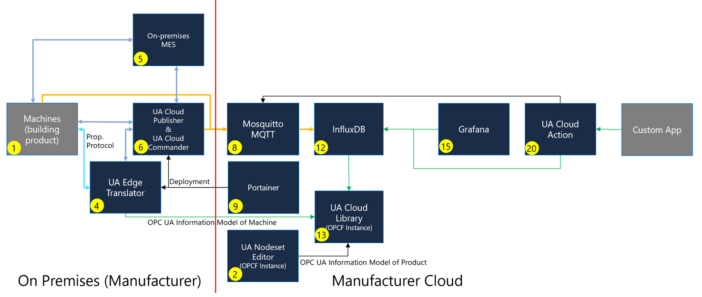

# Cloud Initiative Reference Solution

OPC Foundation Cloud Initiative Open-Source Reference Solution

## Table of Contents

- [Why This Solution](#why-this-solution)
  - [The Problem It Solves](#the-problem-it-solves)
  - [What You Can Do That You Couldn't Before](#what-you-can-do-that-you-couldnt-before)
  - [Zero Lock-In by Design](#zero-lock-in-by-design)
  - [Interoperability Through Open Standards](#interoperability-through-open-standards)
- [Reference Edge Hardware](#reference-edge-hardware) — see [hardware.md](./hardware.md)
- [Deploying the Software Stack](#deploying-the-software-stack)
  - [What the Stack Contains](#what-the-stack-contains)
  - [Install K3s on the Pi](#install-k3s-on-the-pi)
  - [Apply the Stack Manifests](#apply-the-stack-manifests)
  - [Where Telemetry Data Is Persisted](#where-telemetry-data-is-persisted)
- [Simulated Production Line](#simulated-production-line)
  - [Data Flows Immediately](#data-flows-immediately)
  - [Simulated Modbus TCP Device (Non-OPC UA)](#simulated-modbus-tcp-device-non-opc-ua)
    - [Automatic Onboarding via a WoT Thing Description](#automatic-onboarding-via-a-wot-thing-description)
    - [Each Asset Gets Its Own OPC UA Namespace](#each-asset-gets-its-own-opc-ua-namespace)
- [Automatic Certificate Provisioning (GDS Server Push)](#automatic-certificate-provisioning-gds-server-push)
  - [What Happens](#what-happens)
  - [Using It Manually](#using-it-manually)
- [Accessing the Web UIs](#accessing-the-web-uis)
- [Managing the Cluster with Portainer](#managing-the-cluster-with-portainer)
- [Onboarding an OPC UA Device](#onboarding-an-opc-ua-device)
- [Onboarding a Non-OPC UA Device](#onboarding-a-non-opc-ua-device)
- [Querying Data in the InfluxDB Dashboard](#querying-data-in-the-influxdb-dashboard)
- [Dashboards with Grafana](#dashboards-with-grafana)
- [Importing an OPC UA Information Model into InfluxDB (UA Cloud Library)](#importing-an-opc-ua-information-model-into-influxdb-ua-cloud-library)
- [Command & Control with UA Cloud Commander](#command--control-with-ua-cloud-commander)
  - [How It Is Configured](#how-it-is-configured)
  - [Sending a Command](#sending-a-command)
  - [Automated Feedback Loop with UA Cloud Action](#automated-feedback-loop-with-ua-cloud-action)
- [Accessing the OPC UA Web API (UA Cloud Action)](#accessing-the-opc-ua-web-api-ua-cloud-action)
  - [Reaching the Web API](#reaching-the-web-api)
  - [Building Custom Apps with the Starter Kit](#building-custom-apps-with-the-starter-kit)
- [Security Analysis (STRIDE)](#security-analysis-stride)
  - [Trust Boundaries and Assets](#trust-boundaries-and-assets)
  - [STRIDE Threat Assessment](#stride-threat-assessment)
  - [Production Hardening Recommendations](#production-hardening-recommendations)

## Why This Solution

Industrial data is trapped. It sits in machines that speak dozens of incompatible
protocols, behind gateways you don't control, in platforms that charge for
every tag and make leaving expensive. Connecting a factory for data analytics and AI today
usually means picking a vendor — and then living with their protocols, their data
model, their pricing, and their roadmap for decades.

**This reference solution shows there is another way.** It is a complete,
higly scalable, end-to-end industrial IoT stack — from the sensor on the shop floor to a
queryable time-series dashboard and back down to a command that actuates a
machine — built entirely from **open standards** and **open-source components**.
You can deploy it today, on hardware you own, with no subscription fee.

### The Problem It Solves

| Problem | How this solution addresses it |
|---|---|
| **Protocol fragmentation** — every machine speaks something different (Modbus, BACnet, OPC DA/AE, Siemens S7, Rockwell, Beckhoff, Mitsubishi, IEC 61850, OCPP, LoRaWAN, Matter, Redfish, HTTP/REST…) | The **UA Edge Translator** normalises all of them into a single OPC UA information model, using **W3C Web of Things (WoT) Thing Descriptions** as the declarative, vendor-neutral mapping format — no custom code per device. |
| **Data without meaning** — most IoT pipelines ship anonymous numbers that need out-of-band documentation to interpret | Data flows as **OPC UA PubSub** with accompanying **metadata messages**, so every value arrives with its type, semantics, and source. Full **OPC UA Information Models** can be imported from the **UA Cloud Library** so you know what a machine *could* report, not just what it happens to send. |
| **Vendor lock-in** — proprietary apps, proprietary payload formats, and egress/ingest pricing that grows with your data | Every component is open source and speaks **standard MQTT** with **standard OPC UA PubSub JSON** payloads. Point it at any broker, any database, any cloud — or keep it entirely on-premises. |
| **Read-only pipelines** — telemetry goes up, but nothing can come back down safely | **UA Cloud Commander** implements the spec-compliant **OPC UA PubSub Actions** request/response pattern, so cloud or local applications can securely **read, write, call methods, and read history** on shop-floor servers. |
| **No closed loop** — insights stay in dashboards instead of driving action | **UA Cloud Action** watches the time-series data and automatically triggers OPC UA method calls when thresholds are crossed — a genuine **digital feedback loop**, running at the edge with no cloud dependency. |
| **Certificate management pain** — OPC UA security is often disabled because provisioning trust is tedious | **GDS Server Push** provisions certificates and trust lists automatically, so the stack runs *secure by default* instead of secure-in-theory. |
| **Hard to evaluate** — pilots stall because getting *any* data flowing takes days if not weeks | A **simulated production line** ships with the stack. Apply two manifests and real OPC UA telemetry is flowing into dashboards within minutes — no hardware required to start. |

### What You Can Do That You Couldn't Before

- **Connect a brownfield machine without writing code.** Describe it once in a WoT
  Thing Description and it appears as a fully-modelled OPC UA server.
- **Move your entire data pipeline between clouds — or off the cloud — in an
  afternoon.** Because the wire formats are open standards, the broker, database,
  and dashboards are all replaceable parts, not a platform you're bound to.
- **Close the loop from analytics back to the machine**, using a standardised,
  auditable command pattern rather than a bespoke integration.
- **Build your own applications against a standard REST API.** The OPC UA Web API
  (OpenAPI-based) lets any language talk to your OPC UA estate over plain HTTP/JSON.
- **Run the whole thing on a $350 industrial PC** — or scale the same manifests
  across a fleet, or split them between edge and cloud clusters. Same code, same
  standards.

### Zero Lock-In by Design

- **100% open source.** Every component — UA Edge Translator, UA Cloud Publisher,
  UA Cloud Commander, UA Cloud Action, Mosquitto, Telegraf, InfluxDB, Grafana,
  Portainer — is open source. There are no subscription fees, no per-message
  costs, no seat counts, and no expiring trials. Fork it, audit it, extend it.
  > You still own the total cost of ownership: the hardware and
  > the effort to operate, patch, and support the stack yourself. What you avoid is
  > recurring licence and consumption billing — and the dependency that comes with it.
- **Runs anywhere.** It is plain Kubernetes (K3s). Deploy it on a Raspberry Pi in
  a control cabinet, a rack server in your own data center, or a managed
  Kubernetes service in any public cloud. The [edge/cloud split](#deploying-the-software-stack)
  lets you draw the boundary wherever your architecture and data-sovereignty rules
  require — including fully air-gapped.
- **Vendor independence.** Nothing here depends on a specific PLC vendor, cloud
  provider, historian, or dashboard tool. Each box in the pipeline is swappable
  because the interfaces between them are public specifications, not private APIs.
- **No proprietary payloads.** What goes over the wire is OPC UA PubSub JSON over
  MQTT — documented, inspectable, and consumable by anything.

### Interoperability Through Open Standards

Open standards are used *throughout* the stack, not just at the edges:

| Standard | Where it is used |
|---|---|
| **OPC UA** (IEC 62541 series) | The information model and the security model for all shop-floor connectivity. |
| **OPC UA PubSub** (IEC 62541-14) | The telemetry wire format (JSON over MQTT), including metadata messages. |
| **OPC UA Actions** (IEC 62541-14) | The command & control request/response pattern used by Cloud Commander and Cloud Action. |
| **OPC UA GDS Server Push** (IEC 62541-12) | Automated certificate and trust-list provisioning. |
| **OPC UA Web API** (IEC 62541-4, OpenAPI) | The RESTful interface for building custom applications — an OpenAPI representation of the OPC UA Services. |
| **W3C Web of Things (WoT)** (W3C Recommendation) | Thing Descriptions that declaratively map non-OPC UA assets into OPC UA. |
| **MQTT 5.0** (OASIS) | The messaging transport, with TLS and authentication. MQTT v5 features (Correlation Data, Response Topic, Message Expiry) carry the request/response correlation for OPC UA Actions. |
| **Kubernetes** (CNCF) | The deployment and operations model. |

Because these are *published specifications* rather than product features, any
conforming tool — from any vendor — can participate in this architecture. That is
the difference between an integration and an ecosystem.

> **Evaluating this for your organisation?** Start with
> [Deploying the Software Stack](#deploying-the-software-stack): two `kubectl apply`
> commands bring up the full pipeline plus a
> [simulated production line](#simulated-production-line), so you can see live data
> in Grafana before committing any hardware. A
> [STRIDE security analysis](#security-analysis-stride) and
> [production hardening guidance](#production-hardening-recommendations) are
> included to support an enterprise architectural review.

## Reference Edge Hardware

The reference solution runs on any 64-bit Linux host capable of running K3s.
For a validated, industrial-grade edge gateway we **recommend** a fanless
Raspberry Pi Compute Module 5 (CM5) industrial PC — see
**[hardware.md](./hardware.md)** for the recommended bill of materials, SSD
imaging, assembly, and first-boot instructions.

## Deploying the Software Stack

The reference workload is split into two manifests that run on a lightweight
Kubernetes cluster (**K3s**):

| Manifest | Namespace | Components |
|----------|-----------|------------|
| [`edge.yaml`](./edge.yaml) | `edge` | UA Edge Translator, UA Cloud Publisher, UA Cloud Commander |
| [`edge.yaml`](./edge.yaml) | `munich` | Simulated production line (MES, assembly, test, packaging stations) |
| [`cloud.yaml`](./cloud.yaml) | `cloud` | Mosquitto, Telegraf, InfluxDB, Grafana, Portainer, UA Cloud Action |

The **edge** part contains the components that sit next to the machines and speak
OPC UA / industrial protocols, plus a **simulated production line** so the stack
produces real OPC UA telemetry out of the box (see
[Simulated Production Line](#simulated-production-line)). The **cloud** part
contains the broker, storage, visualization, and management components that would
typically run in a data center or public cloud.

> **For convenience, everything can be installed on a single K3s instance** 
> Simply apply both manifests to the same cluster; the two namespaces
> keep the edge and cloud workloads logically separated while they share one node.
> In a distributed deployment, apply `edge.yaml` to the edge cluster and
> `cloud.yaml` to the cloud cluster, and update the cross-namespace service DNS
> names (see *Apply the Stack Manifests*) to point at the remote endpoints.

### What the Stack Contains

Together, `edge.yaml` and `cloud.yaml` deploy the following components, forming an
end-to-end pipeline from industrial protocols to a time-series database.

**Workloads**

| Component | Namespace | Image | Ports |
|---|---|---|---|
| **ua-edgetranslator** | `edge` | `ghcr.io/opcfoundation/ua-edgetranslator:main` | 4840, 5000/5001, 19520/19521, **8080 (UI)** |
| **ua-cloudpublisher** | `edge` | `ghcr.io/barnstee/ua-cloudpublisher:main` | **8081 (UI)** |
| **ua-cloudcommander** | `edge` | `ghcr.io/opcfoundation/ua-cloudcommander:main` | — |
| **mes**, **assembly**, **test**, **packaging** | `munich` | `ghcr.io/digitaltwinconsortium/manufacturingontologies:main` | 4840 (each) |
| **modbus-simulator** | `munich` | `python:3.12-slim` | 502 (Modbus TCP) |
| **mosquitto** | `cloud` | `eclipse-mosquitto:2.0.18` | 8883 (MQTT/TLS) |
| **telegraf** | `cloud` | `telegraf:1.37-alpine` | — |
| **influxdb** | `cloud` | `influxdb:2.7` | **8086 (UI/API)** |
| **grafana** | `cloud` | `grafana/grafana:11.2.0` | **3000 (UI)** |
| **ua-cloudaction** | `cloud` | `ghcr.io/opcfoundation/ua-cloudaction:main` | **8082 (UI/Web API)** |
| **portainer** | `cloud` | `portainer/portainer-ce:2.21.4` | **9443 (HTTPS UI)**, 9000, 8000 |

**What each component does**

- **ua-edgetranslator** — OPC Foundation *UA Edge Translator*. Connects to
  southbound assets and translates protocols (LoRaWAN, OCPP, etc.) into an OPC UA
  information model. Exposes a web UI for configuration.
- **ua-cloudpublisher** — *UA Cloud Publisher*. Subscribes to OPC UA data (from the
  Edge Translator or the simulated line) and publishes it as **OPC UA PubSub** JSON
  messages to the MQTT broker. Exposes a web UI for configuration.
- **ua-cloudcommander** — OPC Foundation *UA Cloud Commander*, the command & control
  **Responder**. Subscribes to `commands/#` for `ua-action-request` messages,
  executes OPC UA operations (Read, HistoricalRead, Write, MethodCall) against
  on-premises OPC UA servers, and replies on the `responses` topic. No web UI.
- **mes / assembly / test / packaging** — the **simulated production line "Munich"**:
  four OPC UA servers modelling a factory line (MES shift schedule plus assembly,
  test and packaging stations), providing live telemetry out of the box. See
  [Simulated Production Line](#simulated-production-line).
- **modbus-simulator** — a **simulated Modbus TCP device** on the Munich line,
  automatically mapped into OPC UA by the Edge Translator via a W3C WoT Thing
  Description. See [Simulated Modbus TCP Device](#simulated-modbus-tcp-device-non-opc-ua).
- **mosquitto** — *Eclipse Mosquitto* MQTT broker carrying the OPC UA PubSub `data/#`
  and `metadata` messages. Configured via `mosquitto-conf` with a TLS listener on
  8883 and username/password authentication (`allow_anonymous false`) using the
  `IOT_USERNAME` / `IOT_PASSWORD` supplied at apply time.
- **telegraf** — *Telegraf* agent that consumes the MQTT PubSub messages, parses them
  with the `json_v2` parser (from the `telegraf-conf` ConfigMap), and writes them to
  InfluxDB as the `opcua_pubsub` (data) and `opcua_metadata` (metadata) measurements.
- **influxdb** — *InfluxDB 2.7* time-series database storing the telemetry.
  Initialized with org `iot`, bucket `mqtt`, and an admin user set to your
  `IOT_USERNAME`. Includes a web UI (Data Explorer / dashboards).
- **grafana** — *Grafana* dashboarding & alerting UI with a **pre-provisioned
  InfluxDB data source** (Flux, org `iot`, bucket `mqtt`) and a **starter dashboard**
  ("OPC UA Telemetry Overview").
- **ua-cloudaction** — OPC Foundation *UA Cloud Action*, the command & control
  **Requestor**. Polls a configured InfluxDB field and, when it crosses a threshold,
  publishes a `ua-action-request` (MethodCall) to the `commands` topic for Cloud
  Commander to execute — closing the digital feedback loop. Also hosts a status web
  UI and the [OPC UA Web API](#accessing-the-opc-ua-web-api-ua-cloud-action).
- **portainer** — *Portainer CE*, a web UI to manage the K3s cluster (workloads,
  logs, shells, events). Runs under a `cluster-admin`-bound ServiceAccount.

**Configuration resources**

| Resource | Kind | Purpose |
|---|---|---|
| `influxdb-auth` | Secret | Holds the `INFLUX_TOKEN` used by InfluxDB (admin), Telegraf (write), Grafana (query), and UA Cloud Action (query). Supplied at deploy time via `${INFLUX_TOKEN}`. |
| `telegraf-conf` | ConfigMap | Telegraf configuration (MQTT inputs + InfluxDB output). |
| `mosquitto-conf` | ConfigMap | Mosquitto broker configuration (TLS listener, authentication, persistence). |
| `ua-cloudpublisher-settings` | ConfigMap | Seeds the Publisher's `settings.json` (broker connection, topics, metadata) and `persistency.json` (published nodes for the simulated line) on first start. |
| `modbus-simulator` | ConfigMap | The Python Modbus TCP simulation server run by the simulated device. |
| `modbus-thing-description` | ConfigMap | W3C WoT Thing Description seeded into UA Edge Translator so the Modbus device is onboarded as an OPC UA asset at startup. |
| `grafana-datasources`, `grafana-dashboard-provider`, `grafana-dashboards` | ConfigMaps | Provision the InfluxDB data source and the starter dashboard. |
| `opcua-model-importer` | ConfigMap | Importer script for [loading OPC UA Information Models](#importing-an-opc-ua-information-model-into-influxdb-ua-cloud-library) from the UA Cloud Library. |
| `portainer-sa-clusteradmin` / `portainer-crb-clusteradmin` | ServiceAccount / ClusterRoleBinding | Grant Portainer in-cluster access to the K3s API server. |

Data flow:



> **Security note:** you choose the credentials at deployment time via the
> `IOT_USERNAME` / `IOT_PASSWORD` variables (see *Apply the Stack Manifests*),
> used consistently across the Edge Translator,
> Cloud Publisher, Cloud Commander, Mosquitto, and InfluxDB for demo purposes.
> Mosquitto uses a
> self-signed TLS certificate generated at pod startup.
> Change these and use certificates from a trusted CA before any production or
> exposed deployment.

### Install K3s on the Pi

Once the device has booted and been updated, install K3s (SSH into the device
first):

```bash
# Install a single-node K3s cluster (server + agent on the same node)
curl -sfL https://get.k3s.io | sh -

# Verify the node is Ready (may take ~30s)
sudo k3s kubectl get nodes
```

To use the standard `kubectl` command and the `KUBECONFIG` without `sudo`:

```bash
mkdir -p ~/.kube
sudo cp /etc/rancher/k3s/k3s.yaml ~/.kube/config
sudo chown "$(id -u):$(id -g)" ~/.kube/config
export KUBECONFIG=~/.kube/config
echo 'export KUBECONFIG=~/.kube/config' >> ~/.bashrc

kubectl get nodes
```

> K3s ships with the **Traefik** ingress controller and a built-in
> **ServiceLB (klipper-lb)** load balancer, so the `type: LoadBalancer`
> Services in the manifest are reachable directly on the node's IP address.

### Apply the Stack Manifests

1. Copy `edge.yaml` and `cloud.yaml` onto the device (e.g. with `git clone`, `scp`, or by
   pasting them into files opened via a text editor like nano).
2. Provide the deployment credentials and InfluxDB token. The manifests
   reference `${IOT_USERNAME}`, `${IOT_PASSWORD}`, and `${INFLUX_TOKEN}`, so set
   them and substitute them at apply time:

   ```bash
   # Choose the shared username/password used by the Edge Translator,
   # Cloud Publisher, Mosquitto broker, and InfluxDB.
   # NOTE: InfluxDB requires the password to be at least 8 characters.
   export IOT_USERNAME="myUsername"
   export IOT_PASSWORD="ChangeMe123"

   # Generate a random InfluxDB token (or supply your own)
   export INFLUX_TOKEN="$(openssl rand -hex 32)"

   # Substitute ONLY these variables and apply. Restricting the variable list is
   # important so envsubst does not touch the runtime shell variables (e.g.
   # $MOSQUITTO_USERNAME) used inside the container start-up commands.
   # Apply the cloud part first so the broker and database exist for the edge part.
   envsubst '${IOT_USERNAME} ${IOT_PASSWORD} ${INFLUX_TOKEN}' < cloud.yaml | kubectl apply -f -
   envsubst '${IOT_USERNAME} ${IOT_PASSWORD} ${INFLUX_TOKEN}' < edge.yaml  | kubectl apply -f -
   ```

   > `envsubst` is part of the `gettext` package (`sudo apt install -y gettext-base`).
   > Keep the values you chose — you'll reuse `IOT_USERNAME` / `IOT_PASSWORD` to
   > log into the web UIs and the broker, and the generated `INFLUX_TOKEN` to
   > authenticate Telegraf and log into InfluxDB via the API.

   > **Deploying edge and cloud on separate clusters?** The manifests reference each
   > other by in-cluster DNS (`mosquitto.cloud.svc.cluster.local`,
   > `influxdb.cloud.svc.cluster.local`, and
   > `ua-edgetranslator.edge.svc.cluster.local`). If the two halves run in different
   > clusters, replace those names with the externally reachable addresses of the
   > remote services before applying.

3. Watch the workloads come up (each part lives in its own namespace):

   ```bash
   kubectl get pods,svc -n cloud
   kubectl get pods,svc -n edge
   # or watch everything at once
   kubectl get pods -A -w
   ```

   All pods should reach `Running`/`Ready`, and each `LoadBalancer` Service should
   receive an `EXTERNAL-IP` (the node's IP).

   If the external IP address for some Kubernetes services shows as `<pending>`, use the following command to assign the external IP address of the traefik service: sudo kubectl patch service <theService> -p '{"spec": {"type": "LoadBalancer", "externalIPs":["<the traefik external IP address>"]}}'.

### Where Telemetry Data Is Persisted

The ingested OPC UA telemetry is stored by **InfluxDB** in the `mqtt` bucket. That
database is backed by a Kubernetes `hostPath` volume, so the data lives directly
on the Pi's NVMe SSD at:

```
/influxdb2
```

Because this is a host directory (not ephemeral pod storage), the telemetry
**survives pod restarts, redeploys, and reboots**. 

Related OPC UA telemetry persistence paths are also mapped as `hostPath` volumes on the Pi:

| Path on the Pi | Component | Contents |
|----------------|-----------|----------|
| `/influxdb2` | InfluxDB | Time-series telemetry, buckets, and InfluxDB config (the primary telemetry store). |
| `/translator/settings`, `/translator/nodesets`, `/translator/pki`, `/translator/logs` | UA Edge Translator | Configuration, OPC UA nodesets, certificates, and logs. |
| `/publisher/settings`, `/publisher/pki`, `/publisher/logs`, `/publisher/store` | UA Cloud Publisher | Configuration, certificates, logs, and the Store & Forward message store (queued messages held during broker/connectivity outages). |
| `/commander/pki`, `/commander/logs` | UA Cloud Commander | OPC UA client certificates and logs. |
| `/productionline/munich/<station>/pki`, `/productionline/munich/<station>/logs` | Simulated production line | OPC UA server certificates and logs for each simulated station (`mes`, `assembly`, `test`, `packaging`). |
| `/mosquitto` | Mosquitto | Broker persistence database (`mosquitto.db`: retained messages and queued messages for persistent sessions). |
| `/portainer` | Portainer | Portainer database, users, and settings. |
| `/grafana` | Grafana | Grafana database, users, and user-created dashboards. |

> **Note:** Keep the `INFLUX_TOKEN` safe, to read the telemetry stored in InfluxDB in backup scenarios.

## Simulated Production Line

So that the stack produces meaningful OPC UA telemetry immediately — without any
physical machines — `edge.yaml` also deploys a **software-only factory
simulation** taken from the Digital Twin Consortium
[Manufacturing Ontologies](https://github.com/digitaltwinconsortium/ManufacturingOntologies#production-line-simulation)
reference solution.

One production line, named **Munich**, is deployed into its own `munich`
namespace. It consists of four OPC UA servers:

| Station | Role | OPC UA endpoint |
|---------|------|-----------------|
| **mes** | Manufacturing Execution System — drives the shift schedule (Morning / Afternoon / Night) for the line. | `opc.tcp://mes.munich/` |
| **assembly** | Assembly station (200 W, 6 s cycle time). | `opc.tcp://assembly.munich/` |
| **test** | Test station (100 W, 6 s cycle time). | `opc.tcp://test.munich/` |
| **packaging** | Packaging station (100 W, 6 s cycle time). | `opc.tcp://packaging.munich/` |

Each station simulates a real machine, exposing OPC UA variables such as
production status, pressure, energy consumption, and product counts, and it
implements OPC UA methods (e.g. opening a pressure relief valve) that the
[command & control path](#command--control-with-ua-cloud-commander) can invoke.

> The stations run in the `munich` namespace on purpose: their in-cluster DNS
> names (`mes.munich`, `assembly.munich`, …) then match the OPC UA application
> URIs the stations advertise, so the endpoint URLs in the Publisher's
> configuration resolve without modification.

### Data Flows Immediately

UA Cloud Publisher is pre-seeded with a **published-nodes persistency file**
(`persistency.json`, taken from the Manufacturing Ontologies Munich
configuration) listing the nodes to subscribe to on each station, **plus the
Modbus variables that UA Edge Translator maps into OPC UA**. Because the seeded
`settings.json` sets `AutoLoadPersistedNodes: true`, the Publisher loads this
list on startup and begins publishing OPC UA PubSub messages to Mosquitto right
away — telemetry appears in InfluxDB and Grafana without any manual onboarding.

To guarantee correct start-up order, the Publisher pod runs two init containers
that block until their dependencies are accepting OPC UA connections on port 4840:
**`wait-for-productionline`** (all four stations) and
**`wait-for-edgetranslator`** (the Edge Translator, which serves the mapped
Modbus asset):

```bash
# watch the simulation come up
kubectl get pods -n munich -w

# the Publisher stays in Init: until the line and the translator are ready
kubectl get pods -n edge
kubectl logs -n edge deploy/ua-cloudpublisher -c wait-for-productionline
kubectl logs -n edge deploy/ua-cloudpublisher -c wait-for-edgetranslator
```

Both seeded files are only copied if they are not already present, so any changes
you later make through the Publisher UI are preserved across restarts.

### Simulated Modbus TCP Device (Non-OPC UA)

The Munich line also includes a **simulated Modbus TCP device** — a "line
conditioning unit" — to demonstrate the other half of the story: bringing a
**non-OPC UA** asset into the OPC UA world *without writing any code*.

It is a small, dependency-free Modbus TCP server (Python standard library only,
so it runs on arm64 and offline) exposing continuously changing registers at
`modbus-simulator.munich.svc.cluster.local:502`, unit id `1`:

| Register | Address | Modbus type | Value |
|---|---|---|---|
| Temperature | Holding 0–1 | float32 | Process temperature (°C) |
| Pressure | Holding 2–3 | float32 | Process pressure (bar) |
| FlowRate | Holding 4–5 | float32 | Coolant flow (l/min) |
| EnergyConsumption | Holding 6–7 | float32 | Cumulative energy (kWh) |
| MotorSpeed | Holding 8 | int16 | Motor speed (rpm) |
| MachineState | Holding 9 | int16 | 0 = stopped, 1 = running, 2 = fault |
| Running | Coil 0 | bool | True while running |
| FaultActive | Coil 1 | bool | True during a high-pressure fault |

#### Automatic Onboarding via a WoT Thing Description

The device is described by a **W3C WoT Thing Description** shipped in the
`modbus-thing-description` ConfigMap. UA Edge Translator loads **every `*.jsonld`
file in its `settings` folder at startup** and onboards it as an OPC UA asset, so
the Modbus registers appear as browsable, subscribable OPC UA variables on
`opc.tcp://<device-ip>:4840` with no manual configuration.

The TD carries the Modbus binding on each property's `forms` entry:

```jsonc
"base": "modbus+tcp://modbus-simulator.munich.svc.cluster.local:502/1",  // trailing /1 = unit id
"forms": [{
  "href": "0?quantity=2",              // start register + number of registers
  "op": ["readproperty", "observeproperty"],
  "modv:entity": "HoldingRegister",    // HoldingRegister | InputRegister | Coil | DiscreteInput
  "modv:type": "xsd:float",            // xsd:float (2 regs), xsd:short (1 reg), xsd:boolean, ...
  "modv:mostSignificantByte": true,    // standard big-endian Modbus word order
  "modv:pollingTime": 2000             // poll interval in ms
}]
```

As with the Publisher, the Edge Translator pod runs two init containers: one
waits for the Modbus simulator to accept connections, and one seeds the Thing
Description into `/translator/settings` — **only if it is not already there**, so
assets you add or edit through the Edge Translator UI survive restarts.

```bash
# watch the simulator and the translator come up
kubectl get pods -n munich -l app=modbus-simulator
kubectl logs -n edge deploy/ua-edgetranslator -c seed-thing-descriptions
```

#### Each Asset Gets Its Own OPC UA Namespace

UA Edge Translator registers **one OPC UA namespace per onboarded asset**, derived
from the Thing Description's `name`:

```
http://opcfoundation.org/UA/<td.name>/
```

Each mapped property becomes a variable in that namespace with a **string NodeId
equal to the property name**. So the simulator's registers are addressable as:

| Property | OPC UA NodeId |
|---|---|
| Temperature | `nsu=http://opcfoundation.org/UA/modbus-simulator/;s=Temperature` |
| Pressure | `nsu=http://opcfoundation.org/UA/modbus-simulator/;s=Pressure` |
| FlowRate | `nsu=http://opcfoundation.org/UA/modbus-simulator/;s=FlowRate` |
| EnergyConsumption | `nsu=http://opcfoundation.org/UA/modbus-simulator/;s=EnergyConsumption` |
| MotorSpeed | `nsu=http://opcfoundation.org/UA/modbus-simulator/;s=MotorSpeed` |
| MachineState | `nsu=http://opcfoundation.org/UA/modbus-simulator/;s=MachineState` |
| Running | `nsu=http://opcfoundation.org/UA/modbus-simulator/;s=Running` |
| FaultActive | `nsu=http://opcfoundation.org/UA/modbus-simulator/;s=FaultActive` |

Because each asset is isolated in its own namespace, two devices can expose
identically-named properties without colliding.

These NodeIds are already listed in the Publisher's seeded `persistency.json`
against the Edge Translator endpoint
(`opc.tcp://ua-edgetranslator.edge.svc.cluster.local:4840`), so the **Modbus data
flows all the way through to InfluxDB and Grafana automatically** — a non-OPC UA
device published as OPC UA PubSub with zero manual configuration, enabling
**fully automatic asset onboarding**!

> **Use this as your template.** To onboard a *real* Modbus (or BACnet, S7,
> Rockwell, OPC DA, …) device, copy this ConfigMap, change `base` to your device's
> address and edit the register addresses/types — no code, no rebuild. Remember to
> add the resulting NodeIds (namespace derived from your TD's `name`) to the
> Publisher if you want the data published. See
> [Onboarding a Non-OPC UA Device](#onboarding-a-non-opc-ua-device) and the
> additional examples in the
> [UA Edge Translator samples](https://github.com/OPCFoundation/UA-EdgeTranslator/tree/main/Samples).

> **Don't want the simulation?** Delete the `munich` namespace
> (`kubectl delete namespace munich`) and remove the `wait-for-productionline` /
> `wait-for-modbus` init containers, the `persistency.json` entries, and the
> `modbus-thing-description` ConfigMap from `edge.yaml`, then onboard your real
> devices as described in
> [Onboarding an OPC UA Device](#onboarding-an-opc-ua-device).

## Automatic Certificate Provisioning (GDS Server Push)

OPC UA is secure by default: a client and a server will only talk to each other
once they **mutually trust** each other's X.509 certificates. Normally that means
manually copying certificates into each server's trust list before publishing can
start.

The seeded UA Cloud Publisher configuration enables the **GDS Server Push**
feature (`"PushCertsBeforePublishing": true`), which automates this entirely.
UA Cloud Publisher acts as a lightweight **Global Discovery Server (GDS)** and
uses the OPC UA *Server Push Configuration* interface (IEC 62541-12) to
provision certificates into each OPC UA server it is about to publish from.

### What Happens

Whenever the Publisher is about to process a published-nodes / `persistency.json`
file (or upload a WoT file to the Edge Translator), it performs the following
against each target OPC UA server:

1. **Connects** to the server's endpoint using administrator credentials — the
   ones stored with the endpoint, falling back to the `OPCUA_USERNAME` /
   `OPCUA_PASSWORD` environment variables (i.e. your `IOT_USERNAME` /
   `IOT_PASSWORD`).
2. **Requests a Certificate Signing Request (CSR)** from the server, asking it to
   **regenerate its private key** (rather than reuse the existing one — older
   sub-2048-bit keys are rejected by modern servers with
   `BadCertificatePolicyCheckFailed`).
3. **Signs the CSR** with the Publisher's own issuer (CA) certificate.
4. **Pushes the new certificate** and the issuer chain back to the server
   (`UpdateCertificate`).
5. **Adds the server's new certificate to the Publisher's own trust list**, so the
   Publisher keeps trusting the server.
6. **Pushes the Publisher's trust list to the server** (`UpdateTrustList`) so the
   server trusts the Publisher in return.
7. **Applies the changes** on the server and disconnects.

The result is a fully automated, mutually trusted, certificate-based OPC UA
security relationship — no manual certificate exchange required. This is why the
[simulated production line](#simulated-production-line) starts streaming data as
soon as it is up, and why onboarding real OPC UA devices usually needs no manual
trust step.

### Using It Manually

- The Publisher UI's **Browse** view has a **Push Certificate** action to trigger
  a GDS push against the currently connected server on demand.
- The **Cert Manager** page lets you inspect the Publisher's trust list, download
  it as a ZIP, and add/remove trusted certificates.
- The behaviour is toggled by **"Push new OPC UA certificates to server before WoT
  file upload or before processing published nodes files (GDS Server Push
  feature)"** on the **Configuration** page (the `PushCertsBeforePublishing`
  setting).

> **Requirements & caveats:** the target server must implement the OPC UA Server
> Push Configuration model and the supplied credentials must map to a role allowed
> to update certificates (typically `SecurityAdmin`). Servers that don't support
> push, or reject the admin credentials, simply log a `GDS server push failed`
> error — you then fall back to exchanging certificates manually. Note that
> pushing replaces the server's certificate with one issued by the Publisher's CA,
> which is appropriate for this reference deployment but should be reviewed
> against your PKI policy in production.

## Accessing the Web UIs

Replace `<device-ip>` with the CM5's IP address (from `ip addr` or
`kubectl get svc`). All services are exposed as `LoadBalancer` types on the node.

| Service | URL | Notes |
|---------|-----|-------|
| **UA Edge Translator** | `http://<device-ip>:8080` | Configure southbound asset connections and the OPC UA information model. Log in with the `IOT_USERNAME` / `IOT_PASSWORD` you set (exposed via the manifest `OPCUA_USERNAME` / `OPCUA_PASSWORD` env vars). |
| **UA Cloud Publisher** | `http://<device-ip>:8081` | Configure which OPC UA nodes to publish and the MQTT broker target (`mosquitto.cloud.svc.cluster.local:8883`, TLS). Log in with the `IOT_USERNAME` / `IOT_PASSWORD` you set (exposed via the manifest `PUBLISHER_USERNAME` / `PUBLISHER_PASSWORD` env vars). |
| **InfluxDB** | `http://<device-ip>:8086` | Time-series UI, Data Explorer, and dashboards. Log in with the `IOT_USERNAME` / `IOT_PASSWORD` you set (org `iot`, bucket `mqtt`). |
| **Portainer** | `https://<device-ip>:9443` | Kubernetes management UI for the K3s cluster. On first access you set the admin password (see *Managing the Cluster with Portainer*). |
| **Grafana** | `http://<device-ip>:3000` | Dashboards & alerting. Log in with the `IOT_USERNAME` / `IOT_PASSWORD` you set. The InfluxDB data source and a starter dashboard are pre-provisioned (see *Dashboards with Grafana*). |
| **UA Cloud Action** | `http://<device-ip>:8082` | Status UI for the automated feedback loop (data-source, broker, and Commander connectivity) and OPC UA Web API. Log in with the `IOT_USERNAME` / `IOT_PASSWORD` you set (see *Automated Feedback Loop with UA Cloud Action*). |

To keep both UIs reachable on the single node,
 **8081** (mapped to the container's 8080) while the Edge Translator stays on **8080**. No extra steps are needed — just browse to `:8080` and `:8081` respectively.

## Managing the Cluster with Portainer

**Portainer CE** provides a web UI to inspect and manage everything running on the
single-node K3s cluster (deployments, pods, logs, container shells, events, and
volumes). It is deployed by `cloud.yaml` and is pre-wired to manage the
cluster it runs in — no manual endpoint configuration is required.

How the K3s connection works:

- The manifest creates a **`portainer-sa-clusteradmin`** ServiceAccount and a
  **ClusterRoleBinding** to the built-in `cluster-admin` role, then runs the
  Portainer pod under that ServiceAccount. Portainer therefore talks to the K3s
  API server **in-cluster** using the mounted ServiceAccount token — it manages
  the local Kubernetes environment out of the box.
- Portainer data (users, settings) is persisted on the Pi at `/portainer`.

First-time setup:

1. Browse to `https://<device-ip>:9443` (accept the self-signed certificate
   warning) within a few minutes of the pod starting.
   > For security, Portainer disables initial admin creation if you don't complete
   > it shortly after startup. If you see a timeout message, restart the pod:
   > `kubectl rollout restart deployment/portainer -n cloud`.
2. Create the **admin** user and password.
3. On the environments page, select the **local Kubernetes** environment (already
   connected via the in-cluster ServiceAccount) and click **Live connect**.
4. You can now browse the `default` namespace to see the Edge Translator, Cloud
   Publisher, Cloud Commander, Mosquitto, Telegraf, and InfluxDB workloads, view
   their logs, exec into containers, and monitor cluster resources.

## Onboarding an OPC UA Device

Use this path when the device already speaks OPC UA (including data that the Edge
Translator has already exposed).

1. Open the **UA Cloud Publisher** UI at `http://<device-ip>:8081` (log in with
   the `IOT_USERNAME` / `IOT_PASSWORD` you set, exposed via the manifest
   `PUBLISHER_USERNAME` / `PUBLISHER_PASSWORD` env vars).
2. Go to **OPC UA Connect** and enter the device's OPC UA endpoint URL, e.g.:
   - The Edge Translator: `opc.tcp://<device-ip>`
   - A standalone OPC UA device: `opc.tcp://<device-address>:<port>`
3. Set the security policy and, if required, the credentials (`OPCUA_USERNAME` /
   `OPCUA_PASSWORD`, i.e. the `IOT_USERNAME` / `IOT_PASSWORD` you set) and click **Connect**.
   > On first connect the client and server exchange certificates. If the UA Cloud Publisher
   > connection is rejected, trust its certificate in the OPC UA device and retry.
   > If the device supports the OPC UA Server Push Configuration model, the
   > Publisher can provision the trust relationship for you automatically — see
   > [Automatic Certificate Provisioning (GDS Server Push)](#automatic-certificate-provisioning-gds-server-push).
4. **Browse** the device's address space and select the variable nodes you want
   to publish and click the 'publish' button.
5. The Publisher immediately begins sending OPC UA PubSub JSON messages to Mosquitto (`data/#`), and the metadata
   describing each dataset to the `metadata` topic. Confirm data is flowing by checking the InfluxDB `mqtt` bucket (see
   [Querying Data in the InfluxDB Dashboard](#querying-data-in-the-influxdb-dashboard)).

## Onboarding a Non-OPC UA Device

The UA Edge Translator uses **W3C Web of Things (WoT) Thing Descriptions (TDs)**
to model a non-OPC UA asset (e.g. Modbus TCP, LoRaWAN, OCPP, or an HTTP/REST
device) and expose its data points as OPC UA nodes. Once mapped, the device is
published exactly like a native OPC UA device.

1. Open the **UA Cloud Publisher** UI at `http://<device-ip>:8081` (log in with
   the `IOT_USERNAME` / `IOT_PASSWORD` you set, exposed via the manifest
   `PUBLISHER_USERNAME` / `PUBLISHER_PASSWORD` env vars).
2. Go to **UA Edge Translator** and provide a **WoT Thing Description** for your asset.
   The Thing Description declares:
   - the **protocol binding** (e.g. `modbus+tcp://<device-ip>:502`, an OCPP/
     LoRaWAN endpoint, or an HTTP base URL),
   - the device's **properties/telemetry** (each becomes an OPC UA variable), and
   - the **datatype, access, and addressing** (e.g. Modbus register/coil, unit id)
     for each property. 
   
   If your device vendor didn't supply a Thing Description, see [Generating WoT Thing Descriptions from PLC Engineering Tools](https://github.com/OPCFoundation/UA-EdgeTranslator#generating-wot-thing-descriptions-from-plc-engineering-tools). and [Generating a WoT Thing Description for a Foxed-Function Asset](https://github.com/OPCFoundation/UA-EdgeTranslator#generating-a-thing-description-for-a-fixed-function-asset) on how to generate a Thing Description.
   
   Uploaded TDs are persisted on the Pi under `/translator/settings`.
   The Edge Translator connects to the asset over its native protocol and instantiates the mapped data points as OPC
   UA nodes in its address space (served at `opc.tcp://<device-ip>:4840`).

   All asset tags specified in the Thing Description as properties are automatically published.

## Querying Data in the InfluxDB Dashboard

InfluxDB 2.x includes a built-in UI with a **Data Explorer** and **Dashboards**
that query data using the **Flux** language.

1. Browse to `http://<device-ip>:8086` and sign in with the `IOT_USERNAME` / `IOT_PASSWORD` you set.
2. Go to **Data Explorer** (the graph icon) to build and preview queries, or
   **Dashboards → Create Dashboard → Add Cell** to pin a query to a dashboard.
3. Data written by Telegraf lands in the **`mqtt`** bucket under the measurements
   **`opcua_pubsub`** (live values) and **`opcua_metadata`** (schema/metadata).

**Example Flux query** (paste into a Data Explorer / dashboard cell in
**Script Editor** mode). This joins the live `opcua_pubsub` data with the
`opcua_metadata` schema on `datasetWriterId` so each series is labelled with its
human-readable metadata name:

```flux
data =
  from(bucket: "mqtt")
    |> range(start: v.timeRangeStart, stop: v.timeRangeStop)
    |> filter(fn: (r) =>
      r._measurement == "opcua_pubsub" and
      r._field == "Payload_VoltageL-N_Value_C"
    )
    |> keep(columns: ["_time", "_value", "datasetWriterId"])
    |> group(columns: ["datasetWriterId"])
    |> sort(columns: ["_time"])

meta =
  from(bucket: "mqtt")
    |> range(start: -30d)
    |> filter(fn: (r) =>
      r._measurement == "opcua_metadata" and
      r._field == "cfgMajor"
    )
    |> group(columns: ["datasetWriterId"])
    |> last()
    |> keep(columns: ["datasetWriterId", "metaName"])
    |> group(columns: ["datasetWriterId"])

join(tables: {d: data, m: meta}, on: ["datasetWriterId"], method: "inner")
  |> map(fn: (r) => ({
      _time: r._time,
      _value: float(v: r._value),
      _source: r.datasetWriterId,
      _tagName: r.metaName
  }))
```

> **Tip:** Use the Data Explorer's visual **Query Builder** to discover the exact
> `_field` names available (they mirror the OPC UA PubSub payload keys, e.g.
> `Payload_<NodeName>_Value`), then switch to the **Script Editor** to refine the
> Flux and save the cell to a dashboard. Set the cell's refresh interval and time
> range at the top of the dashboard for live monitoring.

## Dashboards with Grafana

**Grafana** is deployed by `cloud.yaml` as an alternative to InfluxDB's
built-in dashboards, with richer visualization, templating, and alerting. It comes
**pre-provisioned** so no manual setup is needed beyond logging in.

What the manifest provisions automatically:

- **InfluxDB data source** (`grafana-datasources` ConfigMap) — points at
  `http://influxdb.cloud.svc.cluster.local:8086` using the **Flux** query
  language, org `iot`, and default bucket `mqtt`. The query token is injected from
  the `influxdb-auth` Secret via the `INFLUX_TOKEN` environment variable
  (interpolated into the provisioned data source at startup).
- **Dashboard provider** (`grafana-dashboard-provider` ConfigMap) — loads any
  dashboards found under `/var/lib/grafana/dashboards`.
- **Starter dashboard** (`grafana-dashboards` ConfigMap) — *OPC UA Telemetry
  Overview* (uid `opcua-overview`) with a time-series panel of `opcua_pubsub`
  values, an ingest-rate stat, an active-dataset-writers stat, and a `publisher`
  template variable for filtering.

Usage:

1. Browse to `http://<device-ip>:3000` and log in with your `IOT_USERNAME` /
   `IOT_PASSWORD` (Grafana admin credentials set via `GF_SECURITY_ADMIN_USER` /
   `GF_SECURITY_ADMIN_PASSWORD`).
2. Open **Dashboards → OPC UA Telemetry Overview** to see live data flowing from
   the `mqtt` bucket.
3. Use the **InfluxDB** data source in **Explore** or when adding new panels; write
   Flux queries exactly as in the [InfluxDB dashboard section](#querying-data-in-the-influxdb-dashboard).
4. Grafana settings and any dashboards you create are persisted on the Pi at
   `/grafana`. (The provisioned data source and starter dashboard are managed by
   the ConfigMaps and re-applied on restart.)

> **Note:** the starter dashboard's numeric time-series panel assumes numeric
> fields (e.g. `Payload_<NodeName>_Value`). Adjust the panel's Flux filter to
> match the exact `_field` names your assets publish.

## Importing an OPC UA Information Model into InfluxDB (UA Cloud Library)

You can pre-load the **full set of variables** an OPC UA server *could* expose —
not just the ones currently being published — by importing its **Information
Model** from the OPC Foundation [UA Cloud Library](https://uacloudlibrary.opcfoundation.org)
into InfluxDB.

Each model variable is written as a placeholder point (field `status="[Future]"`)
into a dedicated **`opcua_model`** measurement in the `mqtt` bucket, so you can see
every *potential* node alongside the live `opcua_pubsub` values.

> A separate measurement is used (rather than mixing into `opcua_pubsub`) because
> InfluxDB fields are single-typed — the model's placeholder is a string, while
> live telemetry values are numeric.

The importer is provided as an on-demand Kubernetes Job in
[`import-opcua-model.yaml`](./import-opcua-model.yaml). It uses a small
standard-library Python script that downloads the model's NodeSet2 XML from the
Cloud Library REST API, extracts every `UAVariable`, and writes them to InfluxDB
using the token from the existing `influxdb-auth` Secret.

Steps:

1. **Register** (free) at the UA Cloud Library and note the **model id** of the
   model you want (visible in its Explorer URL — e.g. the `Station` nodeset is
   `1627266626`).
2. **Run the import Job**, supplying your Cloud Library credentials and the model
   id (substituted at apply time):

   ```bash
   export UACLOUDLIB_USERNAME="myUser"
   export UACLOUDLIB_PASSWORD="myPass"
   export UACLOUDLIB_MODEL_ID="1627266626"
   kubectl delete job import-opcua-model -n cloud --ignore-not-found
   envsubst < import-opcua-model.yaml | kubectl apply -f -
   kubectl logs -f job/import-opcua-model -n cloud
   ```

   The log prints how many variables were imported.
3. **Query the imported model** in the InfluxDB Data Explorer or Grafana:

   ```flux
   from(bucket: "mqtt")
     |> range(start: -1h)
     |> filter(fn: (r) => r._measurement == "opcua_model")
     |> filter(fn: (r) => r._field == "displayName")
     |> keep(columns: ["_value", "nodeId", "dataType", "namespaceUri", "model"])
   ```

> The Cloud Library endpoint (`uacloudlibrary.opcfoundation.org`) must be
> reachable from the cluster for the import Job to run. The Job auto-cleans up one
> hour after completion (`ttlSecondsAfterFinished`).

## Command & Control with UA Cloud Commander

While the Publisher → Telegraf → InfluxDB path handles **read-only telemetry**,
**UA Cloud Commander** adds a **command & control** path so a cloud (or local)
application can remotely **read, write, call methods on, and historically read**
OPC UA nodes on the edge — all over the same Mosquitto broker.

Cloud Commander implements the OPC UA PubSub **Actions** request/response pattern
(IEC 62541-14). It acts as the **Responder**: it subscribes to the `commands/#`
topic, executes the requested OPC UA operation against an on-premises OPC UA
server (e.g. the Edge Translator at `opc.tcp://<device-ip>:4840`), and publishes
the result to the `responses` topic.

### How It Is Configured

`ua-cloudcommander` is deployed by `cloud.yaml` and connects to Mosquitto via
these environment variables (no web UI — it is configured entirely through env):

| Variable | Value | Purpose |
|----------|-------|---------|
| `BROKERNAME` | `mosquitto.cloud.svc.cluster.local` | In-cluster Mosquitto Service. |
| `BROKERPORT` | `8883` | TLS MQTT port. |
| `USE_TLS` | `true` | Mosquitto requires TLS. |
| `CLIENTNAME` | `UACloudCommander` | MQTT client id / Responder `PublisherId`. |
| `TOPIC` | `commands/#` | Topic it subscribes to for `ua-action-request` messages. |
| `RESPONSE_TOPIC` | `responses` | Default topic for `ua-action-response` messages (used when a request omits `ResponseAddress`). |
| `USERNAME` / `PASSWORD` | `${IOT_USERNAME}` / `${IOT_PASSWORD}` | Broker credentials (same as the rest of the stack). |
| `UA_USERNAME` / `UA_PASSWORD` | `${IOT_USERNAME}` / `${IOT_PASSWORD}` | Credentials used to sign in to the target OPC UA servers. |

The OPC UA client certificate and logs are persisted on the Pi under
`/commander/pki` and `/commander/logs`.

> **Self-signed TLS:** Mosquitto uses a self-signed certificate generated at pod
> startup. If Cloud Commander rejects the TLS handshake, mount/trust the broker's
> CA certificate in the Commander container (or use a trusted-CA certificate for
> Mosquitto) as recommended in the security note above.

### Sending a Command

Publish a `ua-action-request` NetworkMessage to the `commands` topic and listen
on `responses` for the reply. For example, to **read** a node (from a machine that
can reach the broker, using the stack credentials over TLS):

```bash
# Subscribe for responses in one terminal
mosquitto_sub -h <device-ip> -p 8883 --cafile ca.crt \
  -u "$IOT_USERNAME" -P "$IOT_PASSWORD" -t responses

# Publish a Read request in another terminal
mosquitto_pub -h <device-ip> -p 8883 --cafile ca.crt \
  -u "$IOT_USERNAME" -P "$IOT_PASSWORD" -t commands -m '{
    "MessageId": "32235f26-4a3a-4a56-9f1f-2b6f8a2f0a11",
    "MessageType": "ua-action-request",
    "PublisherId": "MyCloudApp",
    "Timestamp": "2022-11-28T12:01:00.0923534Z",
    "RequestorId": "MyCloudApp",
    "TimeoutHint": 15000,
    "Messages": [
      {
        "DataSetWriterId": 1,
        "ActionTargetId": 1,
        "RequestId": 1,
        "ActionState": 1,
        "Payload": {
          "Endpoint": "opc.tcp://<device-ip>:4840",
          "NodeId": "http://opcfoundation.org/UA/Station/;i=123"
        }
      }
    ]
  }'
```

The `ActionTargetId` selects the operation: **1 = Read**, **2 = HistoricalRead**,
**3 = Write**, **4 = MethodCall**. Cloud Commander replies on `responses` with a
`ua-action-response` message echoing `RequestorId` / `RequestId` and containing
the `Result` (or an `Error`). See the
[UA Cloud Commander documentation](https://github.com/OPCFoundation/UA-CloudCommander)
for the full payload schema of each operation.

### Automated Feedback Loop with UA Cloud Action

**UA Cloud Action** is the automated **Requestor** counterpart to Cloud Commander.
Instead of a human publishing a command, it **polls telemetry and reacts**: on a
15-second loop it queries a configured value and, when it crosses a threshold,
publishes a `ua-action-request` (a `MethodCall`) to the `commands` topic — which
Cloud Commander executes on the target OPC UA server. This closes an edge-local
**digital feedback loop** entirely on the Pi.

In this reference stack it is deployed (`cloud.yaml`) to read from **InfluxDB**
and drive Commander over Mosquitto:

| Variable | Value | Purpose |
|----------|-------|---------|
| `DATA_SOURCE` | `InfluxDB` | Use InfluxDB as the trigger source (instead of Azure Data Explorer). |
| `INFLUX_URL` | `http://influxdb.cloud.svc.cluster.local:8086` | InfluxDB endpoint. |
| `INFLUX_ORG` / `INFLUX_BUCKET` | `iot` / `mqtt` | Org and bucket to query. |
| `INFLUX_MEASUREMENT` | `opcua_pubsub` | Measurement to query. |
| `INFLUX_FIELD` | `Payload_Pressure_Value` | **Numeric field to evaluate — change to match your assets.** |
| `INFLUX_THRESHOLD` | `4000` | Trigger when the latest value exceeds this. |
| `INFLUX_RANGE` | `-1m` | Look-back window for the latest value. |
| `INFLUX_TOKEN` | *(from `influxdb-auth`)* | Query token. |
| `MESSAGING_PLATFORM` | `MQTT` | Reach Commander over MQTT (not Kafka). |
| `MQTT_TARGET` | `UACloudCommander` | Send the full OPC UA PubSub ActionRequest envelope. |
| `BROKER_NAME` / `MQTT_PORT` | `mosquitto…` / `8883` | Mosquitto broker (TLS). |
| `MQTT_USE_TLS` / `MQTT_TLS_INSECURE` | `true` / `true` | TLS with the self-signed broker cert (verification skipped, like Telegraf). |
| `BROKER_USERNAME` / `BROKER_PASSWORD` | `${IOT_USERNAME}` / `${IOT_PASSWORD}` | Broker credentials. |
| `TOPIC` / `RESPONSE_TOPIC` | `commands` / `responses` | The topics Cloud Commander subscribes/replies on. |
| `UA_SERVER_ENDPOINT`, `UA_SERVER_METHOD_ID`, `UA_SERVER_OBJECT_ID`, … | *(placeholders)* | The OPC UA method Cloud Commander invokes on trigger — set these to a real method on your target server (e.g. the Edge Translator). |

> **InfluxDB data source:** support for querying InfluxDB was added to UA Cloud
> Action for this stack (the upstream app queries Azure Data Explorer). The
> `DATA_SOURCE=InfluxDB` branch runs a Flux query for the latest `INFLUX_FIELD`
> value and compares it to `INFLUX_THRESHOLD`. Set `INFLUX_FIELD` to a numeric
> field your assets actually publish (discover exact names in the InfluxDB Data
> Explorer or Grafana), otherwise no trigger will fire.

A small status UI is available at `http://<device-ip>:8082` (log in with your
`IOT_USERNAME` / `IOT_PASSWORD`), showing connectivity to the data source, the
broker, and Cloud Commander.

## Accessing the OPC UA Web API (UA Cloud Action)

In addition to the MQTT-based feedback loop, **UA Cloud Action** exposes an
**OPC UA Web API** — a RESTful, [OpenAPI](https://swagger.io/specification/)-based
HTTP interface to the standard OPC UA services defined in
[IEC 62541-4](https://reference.opcfoundation.org/Core/Part4/v105/docs/). This
lets you build **custom applications** — dashboards, mobile apps, analytics jobs,
or backend integrations — that talk to the edge's OPC UA servers over plain
HTTP/JSON, without embedding a native OPC UA stack.

> **Implemented services:** this reference deployment implements the
> **`Read`**, **`HistoryRead`** (historical read), and **`Browse`** services of
> the OPC UA Web API. Other services (`Write`, `Call`, etc.) are **not implemented** due to security considerations — requests to them are not available. Use UA Cloud Commander (the
> MQTT command path) for `Write`/`Call` operations in the meantime.

> **Note:** the Web API is being implemented in UA Cloud Action. The endpoints and
> auth described below track the OPC UA Web API specification; confirm the exact
> routes against the running service's OpenAPI/Swagger document.

### Reaching the Web API

The API is served by the `ua-cloudaction` container and reachable through its
Service at:

```
http://<device-ip>:8082
```

- The **OpenAPI/Swagger** definition (e.g. `http://<device-ip>:8082/swagger`)
  describes every available route and schema — point your tooling at it to explore
  or generate clients. In the interactive **Swagger UI**, use the **Authorize**
  button to supply the Basic credentials before invoking the `/opcua/read` and
  `/opcua/historyread` operations.
- **Authentication is mandatory.** The UA Cloud Action web UI and Web API require
  **HTTP Basic authentication** on every request — there is no anonymous access.
  Supply the `IOT_USERNAME` / `IOT_PASSWORD` credentials (set via the manifest's
  `ADMIN_USERNAME` / `ADMIN_PASSWORD`) in the HTTP `Authorization: Basic <base64>`
  header. Unauthenticated requests receive `401 Unauthorized` with a
  `WWW-Authenticate: Basic` challenge.
  > The OPC UA Web API specification also allows bearer/JWT tokens in the
  > `Authorization` header (the reference gateway uses OAuth2 JWTs); Basic auth is
  > what this reference deployment mandates.
- **The API is rate limited** per client IP using a fixed window. The limit and
  window are configurable via the `RATE_LIMIT_PERMIT` and
  `RATE_LIMIT_WINDOW_SECONDS` environment variables (defaulting to **60 requests
  per 60 seconds** in `cloud.yaml`). Requests exceeding the limit receive
  `429 Too Many Requests`.
- Behind the OPC UA Web API, UA Cloud Action forwards the requested service to the
  target OPC UA server (e.g. the Edge Translator at
  `opc.tcp://ua-edgetranslator.edge.svc.cluster.local:4840`).

### Building Custom Apps with the Starter Kit

Use the OPC Foundation
[UA Web API Starter Kit](https://github.com/OPCFoundation/UA-WebApi-StarterKit/tree/master/UaWebApiClient)
as the starting point. Its `UaWebApiClient` folder contains ready-to-run sample
clients in several environments that call the OPC UA Web API using pre-built
**stubs** (classes/constants for the OPC UA services, `BrowseName`s, and
`NodeId`s):

| Sample client | Language / stubs |
|---------------|------------------|
| `UaWebApiClient/csharp` | C# — [DotNet stubs](https://github.com/OPCFoundation/opcua-webapi-dotnet) |
| `UaWebApiClient/nodejs` | JavaScript — [TypeScript stubs](https://github.com/OPCFoundation/opcua-webapi-typescript) |
| `UaWebApiClient/react`  | TypeScript (browser) — TypeScript stubs |
| `UaWebApiClient/python` | Python — [Python stubs](https://github.com/OPCFoundation/opcua-webapi-python) |

Typical workflow to build your own app:

1. **Clone the starter kit** and pick the sample client that matches your stack:
   ```bash
   git clone https://github.com/OPCFoundation/UA-WebApi-StarterKit.git
   cd UA-WebApi-StarterKit/UaWebApiClient
   ```
2. **Point the client at your Web API endpoint** — set its base URL to
   `http://<device-ip>:8082` (the UA Cloud Action Web API) and set the
   `Authorization: Basic <base64(user:pass)>` header (mandatory) using your
   `IOT_USERNAME` / `IOT_PASSWORD`.
3. **Use the pre-built stubs** to invoke OPC UA services with typed
   requests/responses instead of hand-crafting JSON. In this deployment the
   available operations are **`Read`**, **`HistoryRead`**, and **`Browse`**
   (reading current and historical variable values and browsing the address
   space); `Write` and `Call` are not yet exposed by the Web API.
4. **(Optional) Generate model-specific classes.** For DataTypes from a custom
   information model, convert its NodeSet to an OpenAPI schema with the
   [Opc.Ua.ModelCompiler](https://github.com/OPCFoundation/UA-ModelCompiler), then
   generate typed classes with the
   [OpenAPI Generator](https://openapi-generator.tech/) — exactly as the starter
   kit does — so your app understands the model's structured values.
5. **Iterate from a sample** — start from the closest `UaWebApiClient` sample and
   extend it into your own dashboard, service, or integration.

> Because the interface is standard OpenAPI, you can also generate a client in any
> other language supported by the OpenAPI Generator directly from the service's
> OpenAPI document, rather than using the pre-built stubs.

## Security Analysis (STRIDE)

This section applies the **STRIDE** threat-modeling framework
(**S**poofing, **T**ampering, **R**epudiation, **I**nformation disclosure,
**D**enial of service, **E**levation of privilege) to the reference stack. It is
intended to help you understand the residual risks of the **demo** configuration
and what to change before an internet-exposed or production deployment.

> **Important:** the reference manifest is optimized for a self-contained,
> single-node demo. It ships with convenience defaults (shared credentials, a
> self-signed broker certificate generated at pod start, `LoadBalancer` services
> bound to the node IP, and permissive TLS verification in Telegraf). These are
> **not** appropriate for production as-is — see
> [Production Hardening Recommendations](#production-hardening-recommendations).

### Trust Boundaries and Assets

```
[Field devices] --(OPC UA / Modbus / LoRaWAN / OCPP / HTTP)--> [UA Edge Translator]
[Simulated line: mes/assembly/test/packaging (OPC UA :4840)]            |
[Modbus simulator (Modbus TCP :502, no auth)] --------------------------+
      |                                                                |
      |  Boundary A: device <-> edge                                   | (OPC UA server :4840)
      v                                                                v
[UA Cloud Publisher] --(MQTT/TLS :8883, user/pass)--> [Mosquitto] --(MQTT/TLS)--> [Telegraf] --(HTTP + token)--> [InfluxDB]
      ^                                                  ^   ^                                                        ^   ^
      |                            [UA Cloud Commander] -+   |  (commands/responses)                                  |   |
      |                            [UA Cloud Action] --------+--(reads InfluxDB threshold, publishes commands)--------+   |
      |                                                                                                    [Grafana] -----+ (query token)
      |                                                                                          [Model importer Job] ----+ (writes opcua_model)
      |  Boundary B: operator <-> web UIs (:8080/:8081/:8082/:8086/:3000/:9443, basic auth)                               |
      +----------- Boundary C: node/cluster host (K3s + Portainer cluster-admin, hostPath volumes) -----------------------+
```

Key assets: the telemetry data (in transit and at rest in InfluxDB), the shared
`IOT_USERNAME` / `IOT_PASSWORD` credentials, the `INFLUX_TOKEN`, the UA Cloud
Library credentials used by the import Job, the broker's private key, the
Portainer `cluster-admin` ServiceAccount token (full control of the cluster), and
the K3s node itself (root of trust for all `hostPath` data).

### STRIDE Threat Assessment

| STRIDE category | Representative threats in this stack | Mitigations already in place | Residual risk / gaps |
|-----------------|--------------------------------------|------------------------------|----------------------|
| **Spoofing** (identity) | A rogue client impersonates the Publisher or **UA Cloud Commander/Action** to the broker; an attacker impersonates a web UI user (Translator, Publisher, Grafana, UA Cloud Action, or Portainer); a fake OPC UA server feeds the Publisher; a forged `ua-action-request` triggers an OPC UA method; an unauthenticated caller hits the **OPC UA Web API**; anything on the pod network impersonates a Modbus master. | MQTT broker requires username/password (`allow_anonymous false`); all web UIs (`:8080/:8081/:8082/:3000/:9443`) require login; the **UA Cloud Action web UI and OPC UA Web API mandate HTTP Basic authentication on every request (no anonymous access)**; OPC UA supports certificate exchange between Publisher/Commander and server. | Single shared credential set across all components (including Grafana/Portainer admin and the Web API); Basic-auth credentials are only as safe as the transport (send over TLS in production); no per-service identities or mutual TLS (mTLS); broker does not authenticate clients by certificate; any client that can publish to `commands` can drive Commander; **Modbus TCP has no authentication whatsoever by protocol design** — the simulator (and any real Modbus device) trusts every caller. |
| **Tampering** (integrity) | Modification of telemetry in transit; tampering with `hostPath` config/cert files on the node; editing the ConfigMaps; **altering the imported `opcua_model` data** or the model importer script; a malicious command writing/actuating an OPC UA node via Commander; writing Modbus coils/registers on the simulated device. | MQTT is carried over TLS (8883); config is delivered via Kubernetes ConfigMaps/Secrets; Commander/Action send spec-compliant OPC UA PubSub Action envelopes; the seeded Thing Description and settings are delivered read-only from ConfigMaps. | Telegraf and UA Cloud Action use TLS verification skip (`insecure_skip_verify` / `MQTT_TLS_INSECURE=true`), so a man-in-the-middle with any cert is accepted; `hostPath` volumes (`/influxdb2`, `/translator/*`, `/publisher/*`, `/commander/*`, `/productionline/*`, `/mosquitto`, `/portainer`, `/grafana`) are writable by anyone with node access; no message signing on payloads; Commander performs Writes/MethodCalls with no per-action authorization; **Modbus traffic is plaintext and unauthenticated**, so anything on the pod network can read or write the simulated device's registers. |
| **Repudiation** (auditability) | An operator changes a device mapping, publish set, Grafana dashboard, or issues a command and denies it; no record of who logged in or who imported a model. | Component logs are written to `hostPath` `logs` directories and pod stdout; Portainer records some cluster events. | No centralized, tamper-evident audit log; shared credentials make actions unattributable to an individual; command/action requests and model imports are not attributably logged; no log shipping or retention policy. |
| **Information disclosure** (confidentiality) | Sniffing telemetry; reading credentials from the manifest; exposed dashboards (Grafana, Portainer, UA Cloud Action) on the node IP; leaking the **UA Cloud Library credentials** used by the import Job. | MQTT is encrypted with TLS; `INFLUX_TOKEN` is stored in a Kubernetes `Secret`; credentials are supplied at apply time (not committed to git). | Credentials (including UA Cloud Library and Grafana/Portainer admin) are injected as plain-text env vars (visible via `kubectl describe`/`exec`); Kubernetes Secrets are base64, not encrypted at rest by default; self-signed broker cert offers encryption but no server-identity assurance; all UIs are exposed on the node IP with no network policy. |
| **Denial of service** (availability) | Flooding the broker or web UIs; filling the node disk with telemetry or repeated model imports; a crash loop; a runaway feedback loop from UA Cloud Action; overloading the simulated stations or the Modbus simulator with connections. | Liveness/readiness probes restart unhealthy pods; single-replica deployments recover automatically; the importer is a short-lived Job with `ttlSecondsAfterFinished`; **UA Cloud Action has a built-in rate limiter that bounds how often it actuates**; the Modbus simulator declares CPU/memory `requests`/`limits`. | No rate limiting, quotas, or `resources` requests/limits on most pods; unbounded InfluxDB growth on the local SSD (now including `opcua_model` points); a single node is a single point of failure; the broker persists to `hostPath` (`/mosquitto`), reducing message loss on restart though the single node remains a SPOF; UA Cloud Action's rate limit still needs tuning for your environment. |
| **Elevation of privilege** (authorization) | Container escape to the node; a compromised pod reading another component's data via shared host paths; using the InfluxDB admin token for full DB control; **abusing Portainer's `cluster-admin` ServiceAccount to take over the whole cluster**; using Commander/Action to reach and control OT devices. | Distinct container images per component; `nodeSelector` pins workloads to Linux; the importer Job uses `restartPolicy: Never`. | Containers run with default (often root) user and no `securityContext`; no `NetworkPolicy` isolation between pods; the InfluxDB token is an all-powerful admin token; **Portainer is bound to `cluster-admin`, so compromising it compromises the cluster**; Commander bridges IT→OT with method-call/write capability and no fine-grained authorization; no RBAC scoping for the workloads. |

### Production Hardening Recommendations

The following changes move the stack from a demo toward a production-grade
deployment. Prioritize the items marked **(High)**.

1. **Use unique, per-service credentials (High).** Replace the single shared
   `IOT_USERNAME` / `IOT_PASSWORD` with distinct identities for the Translator UI,
   Publisher UI, broker client, and InfluxDB admin. Store them in a real secrets
   manager (e.g. HashiCorp Vault, Sealed Secrets, or an external secrets
   operator) rather than plain-text env vars.
2. **Deploy trusted TLS certificates and enforce verification (High).** Replace
   the self-signed, pod-generated broker certificate with one from a trusted CA
   (e.g. via **cert-manager**). Remove `insecure_skip_verify = true` from the
   Telegraf MQTT inputs and pin the broker CA so man-in-the-middle attacks are
   prevented. Enable TLS on the web UIs (terminate at an ingress).
3. **Enable mutual TLS (mTLS) or per-client auth on the broker.** Configure
   Mosquitto to authenticate publishers/subscribers by client certificate in
   addition to username/password, and use ACLs to restrict which topics each
   client may publish/subscribe to.
4. **Scope the InfluxDB token (High).** Do not use the all-powerful admin token
   for Telegraf. Create a dedicated write-only token limited to the `mqtt`
   bucket, and separate read tokens for dashboards.
5. **Restrict network exposure (High).** Do not expose `LoadBalancer` services
   directly on the node IP. Front the web UIs with an authenticating reverse
   proxy/ingress, place the broker and database on an internal network only, and
   add Kubernetes **`NetworkPolicy`** rules so pods can only reach the peers they
   need.
6. **Harden the pods.** Add a `securityContext` (`runAsNonRoot: true`,
   `readOnlyRootFilesystem: true`, drop Linux capabilities,
   `allowPrivilegeEscalation: false`) and set CPU/memory `requests`/`limits` to
   contain resource-exhaustion and blast radius.
7. **Protect data at rest.** Enable encryption at rest for the node's disk
   (`/influxdb2` and the other `hostPath` volumes) and for Kubernetes Secrets
   (e.g. a KMS provider or an encrypted etcd). Replace ad-hoc `hostPath` volumes
   with managed `PersistentVolumeClaims` where possible.
8. **Add auditing and monitoring.** Ship component and access logs to a central,
   tamper-evident store; enable Kubernetes audit logging; and add alerting on
   authentication failures, pod restarts, and disk usage.
9. **Manage capacity and availability.** Set InfluxDB retention policies to bound
   growth, back up `/influxdb2` regularly, and consider multi-node/HA for the
   broker and database to remove the single-point-of-failure.
10. **Keep software patched.** Pin and regularly update the container image
     versions, apply OS/K3s security updates, and scan images for known
     vulnerabilities as part of your release process.
11. **Scope Portainer's cluster access (High).** The demo binds Portainer to the
    built-in `cluster-admin` role. For production, grant it a least-privilege
    `Role`/`ClusterRole` limited to the namespaces and resources operators
    actually manage, protect its UI behind the ingress, and enforce strong,
    per-user Portainer accounts (not the shared credentials).
12. **Authorize and throttle the command/control path.** Restrict who can publish
    to the `commands` topic (broker ACLs) and validate/allow-list the OPC UA
    methods and nodes UA Cloud Commander may Write/Call. UA Cloud Action includes a **built-in rate limiter** on its actuation, so a faulty threshold
    or spoofed value cannot drive OT devices uncontrollably; tune its limit for
    your environment. Treat the UA Cloud Library import credentials as secrets and
    restrict the import Job's egress.
