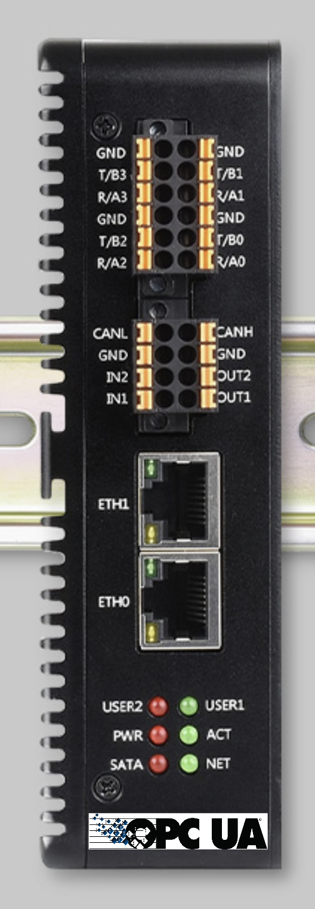

# Cloud Initiative Reference Solution

OPC Foundation Cloud Initiative Open-Source Reference Solution

## Table of Contents

- [Reference Edge Hardware](#reference-edge-hardware)
  - [Bill of Materials (Purchasing)](#bill-of-materials-purchasing)
  - [Software Installation (Imaging the SSD)](#software-installation-imaging-the-ssd)
  - [Hardware Installation](#hardware-installation)
    - [First-Boot Configuration](#first-boot-configuration)
- [Deploying the IoT Stack](#deploying-the-iot-stack)
  - [What the Stack Contains](#what-the-stack-contains)
  - [Install K3s on the Pi](#install-k3s-on-the-pi)
  - [Apply the Stack Manifest](#apply-the-stack-manifest)
  - [Where Telemetry Data Is Persisted](#where-telemetry-data-is-persisted)
- [Accessing the Web UIs](#accessing-the-web-uis)
- [Managing the Cluster with Portainer](#managing-the-cluster-with-portainer)
- [Onboarding Devices](#onboarding-devices)
  - [Configuring the Broker Connection and Metadata (UA Cloud Publisher)](#configuring-the-broker-connection-and-metadata-ua-cloud-publisher)
  - [Onboarding an OPC UA Device (via UA Cloud Publisher)](#onboarding-an-opc-ua-device-via-ua-cloud-publisher)
  - [Onboarding a Non-OPC UA Device (map it in UA Edge Translator first)](#onboarding-a-non-opc-ua-device-map-it-in-ua-edge-translator-first)
  - [Querying Data in the InfluxDB Dashboard](#querying-data-in-the-influxdb-dashboard)
- [Dashboards with Grafana](#dashboards-with-grafana)
- [Importing an OPC UA Information Model into InfluxDB (UA Cloud Library)](#importing-an-opc-ua-information-model-into-influxdb-ua-cloud-library)
- [Command & Control with UA Cloud Commander](#command--control-with-ua-cloud-commander)
  - [How It Is Configured](#how-it-is-configured)
  - [Sending a Command](#sending-a-command)
  - [Automated Feedback Loop with UA Cloud Action](#automated-feedback-loop-with-ua-cloud-action)
- [Accessing the OPC UA Web API (UA Cloud Action)](#accessing-the-opc-ua-web-api-ua-cloud-action)
  - [Reaching the Web API](#reaching-the-web-api)
  - [Building Custom Apps with the Starter Kit](#building-custom-apps-with-the-starter-kit)
- [Security Analysis (STRIDE)](#security-analysis-stride)
  - [Trust Boundaries and Assets](#trust-boundaries-and-assets)
  - [STRIDE Threat Assessment](#stride-threat-assessment)
  - [Production Hardening Recommendations](#production-hardening-recommendations)

## Reference Edge Hardware

The reference solution is validated on a compact, fanless industrial PC built
around the Raspberry Pi Compute Module 5 (CM5). This platform provides an
industrial-grade, DIN-rail-mountable edge gateway suitable for running the
OPC Foundation Cloud Initiative open-source reference workloads.



### Bill of Materials (Purchasing)

Purchase the following components from Waveshare as a complete kit:

| # | Component | Description | Product Page |
|---|-----------|-------------|--------------|
| 1 | **IPCBox-CM5-A** | Industrial computer / enclosure kit for the Raspberry Pi Compute Module 5 (aluminum-alloy passive-cooling case, carrier board, dual Gigabit Ethernet, USB, dual HDMI, M.2 M-Key NVMe slot, wide-voltage DC input, RTC). | <https://www.waveshare.com/ipcbox-cm5-a.htm> |
| 2 | **Raspberry Pi Compute Module 5** | The system-on-module (BCM2712 quad-core Cortex-A76). Select a variant **without eMMC** (not needed), a minimum of 8GB RAM and optionally WiFi to match your needs. | <https://www.waveshare.com/compute-module-5.htm> |
| 3 | **SK NVMe 2242 128G SSD (M.2)** | 128 GB M.2 2242 NVMe SSD used for the operating system and application data storage. | <https://www.waveshare.com/sk-nvme-2242-128g-ssd-m.2.htm> |
| 4 | **USB-to-M.2 (NVMe) adapter / enclosure** | A USB 3.x adapter that accepts an **M-Key M.2 NVMe** SSD (2242 compatible). Used to connect the SSD to a separate PC so it can be imaged with Raspberry Pi Imager before final assembly. | <https://www.waveshare.com/usb-to-sata.htm> |

### Software Installation (Imaging the SSD)

The operating system is written to the NVMe SSD from a **separate PC** using the
USB-to-M.2 adapter and Raspberry Pi Imager. Do this before assembling the unit.

1. **Insert the SSD into the USB-to-M.2 adapter.** Seat the SK NVMe 2242 128G SSD
   in the adapter's M-Key slot and secure it, then plug the adapter into a USB 3.x
   port on your PC. The drive should enumerate as a USB mass-storage device.
2. **Install Raspberry Pi Imager** on the PC from
   <https://www.raspberrypi.com/software/> and launch it.
3. **Select the target device:** click **CHOOSE DEVICE** and pick
   **Raspberry Pi Compute Module 5**.
4. **Select the OS:** click **CHOOSE OS** and pick
   **Raspberry Pi OS Lite (64-bit)** (recommended for a headless edge gateway) or
   the full **Raspberry Pi OS (64-bit)**.
5. **Select the storage:** click **CHOOSE STORAGE** and pick the SK NVMe SSD
   presented through the USB-to-M.2 adapter.
   > ⚠️ Double-check you are selecting the SSD and not another drive on your PC —
   > imaging is destructive and erases the selected device.
6. **Pre-configure OS settings:** click **NEXT → EDIT SETTINGS** and set the
   **hostname**, **username/password**, **Wi‑Fi** (if used), **locale/timezone**,
   and enable **SSH** on the Services tab. This allows a fully headless first boot.
7. **Write and verify.** Click **SAVE → YES → WRITE** and wait for Imager to write
   and verify the image.
8. **Eject** the adapter, remove the SSD, and proceed to the
   [Hardware Installation](#hardware-installation) to assemble the device.

### Hardware Installation

> **Safety:** Power off and disconnect the DC input before opening the case.
> Work on an anti-static surface and handle the CM5 and SSD by their edges.

> **Image the SSD first.** Complete the [Software Installation](#software-installation-imaging-the-ssd)
> steps below to write Raspberry Pi OS onto the NVMe SSD using the USB-to-M.2
> adapter **before** installing the SSD into the enclosure. 

1. **Open the enclosure.** Remove the screws securing the IPCBox-CM5-A cover to
   expose the CM5 carrier board and the M.2 slot.
2. **Install the (already-imaged) NVMe SSD.** Insert the SK NVMe 2242 128G SSD
   into the M.2 M-Key slot at roughly a 30° angle, press it down flat, and secure
   it with the provided M.2 standoff screw.
3. **Install the Compute Module 5.** Align the two high-density connectors on the
   CM5 with the mating connectors on the carrier board and press firmly and
   evenly until the module seats fully. Fasten the CM5 mounting screws.
4. **Apply the thermal interface.** Ensure the thermal pad between the CM5 SoC
   and the aluminum case/heat spreader is in place so the enclosure can act as a
   passive heatsink.
5. **Reassemble the enclosure** and reinstall the cover screws.
6. **Connect peripherals.** Attach the Ethernet cable, and (optionally, for
   first-time console access) an HDMI monitor and USB keyboard.
7. **Connect power.** Wire the DC input within the enclosure's rated voltage
   range (7V to 36V, so a 24V industrial power supply is ideal, or simply use the supplied AC/DC adapter for bench testing) to the power terminal / jack and switch it on. The power/status LED
   should illuminate and the device will boot from the NVMe SSD.

#### First-Boot Configuration

1. Power on the assembled device and log in (via the HDMI/keyboard console or over
   SSH using the hostname/credentials configured during imaging):
   ```bash
   ssh <username>@<hostname>.local
   ```
2. Update the system:
   ```bash
   sudo apt update && sudo apt full-upgrade -y
   ```
3. Verify the NVMe SSD is the active root device and the CM5 memory is detected:
   ```bash
   lsblk
   free -h
   ```
4. Confirm network connectivity on the built-in Gigabit Ethernet:
   ```bash
   ip addr
   ping -c3 opcfoundation.org
   ```

## Deploying the IoT Stack

The reference workload is defined in [`iot-stack.yaml`](./iot-stack.yaml) and runs
on a lightweight single-node Kubernetes cluster (**K3s**) on the CM5.

### What the Stack Contains

`iot-stack.yaml` deploys the following components, forming an end-to-end pipeline
from industrial protocols to a time-series database:

| Component | Image | Role | Ports |
|-----------|-------|------|-------|
| **ua-edgetranslator** | `ghcr.io/opcfoundation/ua-edgetranslator:main` | OPC Foundation **UA Edge Translator** — connects to southbound assets and translates protocols (LoRaWAN, OCPP, etc.) into an OPC UA information model. Exposes a web UI for configuration. | 4840 (OPC UA server), 5000/5001 (LoRaWAN), 19520/19521 (OCPP), **8080 (web UI)** |
| **ua-cloudpublisher** | `ghcr.io/barnstee/ua-cloudpublisher:main` | **UA Cloud Publisher** — subscribes to OPC UA data (from the edge translator) and publishes it as **OPC UA PubSub** JSON messages to the MQTT broker. Exposes a web UI for configuration. | **8081 (web UI)** |
| **ua-cloudcommander** | `ghcr.io/opcfoundation/ua-cloudcommander:main` | OPC Foundation **UA Cloud Commander** — the command & control **Responder**. Subscribes to the Mosquitto `commands/#` topic for `ua-action-request` messages, executes OPC UA operations (Read, HistoricalRead, Write, MethodCall) against on-premises OPC UA servers (e.g. the Edge Translator), and publishes `ua-action-response` messages back to the `responses` topic. Has no web UI. | — |
| **mosquitto** | `eclipse-mosquitto:2.0.18` | **Eclipse Mosquitto** MQTT broker that carries the OPC UA PubSub `data/#` and `metadata` messages between the publisher and Telegraf. Configured via `mosquitto-conf` (TLS + authentication required with the `IOT_USERNAME` / `IOT_PASSWORD` credentials supplied at apply time, exposed to the broker via the `MOSQUITTO_USERNAME` / `MOSQUITTO_PASSWORD` env vars, TLS listener on 8883). | 8883 (MQTT/TLS) |
| **telegraf** | `telegraf:1.37-alpine` | **Telegraf** agent that consumes the MQTT PubSub messages, parses them with the `json_v2` parser (defined in the `telegraf-conf` ConfigMap), and writes them into InfluxDB. Measurements: `opcua_pubsub` (data) and `opcua_metadata` (metadata). | — |
| **influxdb** | `influxdb:2.7` | **InfluxDB 2.7** time-series database that stores the ingested telemetry. Initialized with org `iot`, bucket `mqtt`, and admin user set to your `IOT_USERNAME`. Exposes a web UI (Data Explorer / dashboards). | **8086 (web UI/API)** |
| **grafana** | `grafana/grafana:11.2.0` | **Grafana** — dashboarding & alerting UI with a **pre-provisioned InfluxDB data source** (Flux, org `iot`, bucket `mqtt`) and a **starter dashboard** ("OPC UA Telemetry Overview"). | **3000 (web UI)** |
| **ua-cloudaction** | `ghcr.io/opcfoundation/ua-cloudaction:main` | OPC Foundation **UA Cloud Action** — the command & control **Requestor**. Polls a configured **InfluxDB** field and, when it crosses a threshold, publishes a `ua-action-request` (MethodCall) to the Mosquitto `commands` topic for UA Cloud Commander to execute, closing the digital feedback loop. Has a status web UI and implements the OPC UA Web API for app access. | **8082 (web UI)** |
| **portainer** | `portainer/portainer-ce:2.21.4` | **Portainer CE** — web UI to manage the single-node K3s cluster (workloads, logs, shells, events). Runs with a `cluster-admin`-bound ServiceAccount so it manages the cluster in-cluster via the K3s API server. | **9443 (HTTPS UI)**, 9000 (HTTP UI), 8000 (edge tunnel) |
| **influxdb-auth** (Secret) | — | Holds the `INFLUX_TOKEN` used by InfluxDB (admin token), Telegraf (write token), Grafana (query token), and UA Cloud Action (query token). Provided at deploy time via the `${INFLUX_TOKEN}` variable. | — |
| **telegraf-conf** / **mosquitto-conf** (ConfigMaps) | — | Configuration for Telegraf (MQTT inputs + InfluxDB output) and Mosquitto respectively. | — |

Data flow:


> **Security note:** you choose the credentials at deployment time via the
> `IOT_USERNAME` / `IOT_PASSWORD` variables (see *Apply the Stack Manifest*),
> used consistently across the Edge Translator,
> Cloud Publisher, Cloud Commander, Mosquitto, and InfluxDB for demo purposes.
> Mosquitto uses a
> self-signed TLS certificate generated at pod startup.
> Change these and use certificates from a trusted CA before any production or
> exposed deployment.

### Install K3s on the Pi

Once the device has booted and been updated, install K3s (SSH into the device
first):

```bash
# Install a single-node K3s cluster (server + agent on the same node)
curl -sfL https://get.k3s.io | sh -

# Verify the node is Ready (may take ~30s)
sudo k3s kubectl get nodes
```

To use the standard `kubectl` command and the `KUBECONFIG` without `sudo`:

```bash
mkdir -p ~/.kube
sudo cp /etc/rancher/k3s/k3s.yaml ~/.kube/config
sudo chown "$(id -u):$(id -g)" ~/.kube/config
export KUBECONFIG=~/.kube/config
echo 'export KUBECONFIG=~/.kube/config' >> ~/.bashrc

kubectl get nodes
```

> K3s ships with the **Traefik** ingress controller and a built-in
> **ServiceLB (klipper-lb)** load balancer, so the `type: LoadBalancer`
> Services in the manifest are reachable directly on the node's IP address.

### Apply the Stack Manifest

1. Copy `iot-stack.yaml` onto the device (e.g. with `git clone`, `scp`, or by
   pasting it into a file opened via a text editor like nano).
2. Provide the deployment credentials and InfluxDB token. The manifest
   references `${IOT_USERNAME}`, `${IOT_PASSWORD}`, and `${INFLUX_TOKEN}`, so set
   them and substitute them at apply time:

   ```bash
   # Choose the shared username/password used by the Edge Translator,
   # Cloud Publisher, Mosquitto broker, and InfluxDB.
   # NOTE: InfluxDB requires the password to be at least 8 characters.
   export IOT_USERNAME="myUsername"
   export IOT_PASSWORD="ChangeMe123"

   # Generate a random InfluxDB token (or supply your own)
   export INFLUX_TOKEN="$(openssl rand -hex 32)"

   # Substitute ONLY these variables and apply. Restricting the variable list is
   # important so envsubst does not touch the runtime shell variables (e.g.
   # $MOSQUITTO_USERNAME) used inside the container start-up commands.
   envsubst '${IOT_USERNAME} ${IOT_PASSWORD} ${INFLUX_TOKEN}' < iot-stack.yaml | kubectl apply -f -
   ```

   > `envsubst` is part of the `gettext` package (`sudo apt install -y gettext-base`).
   > Keep the values you chose — you'll reuse `IOT_USERNAME` / `IOT_PASSWORD` to
   > log into the web UIs and the broker, and the generated `INFLUX_TOKEN` to
   > authenticate Telegraf and log into InfluxDB via the API.

3. Watch the workloads come up:

   ```bash
   kubectl get pods -w
   kubectl get svc
   ```

   All pods should reach `Running`/`Ready`, and each `LoadBalancer` Service should
   receive an `EXTERNAL-IP` (the node's IP).

   If the external IP address for some Kubernetes services shows as `<pending>`, use the following command to assign the external IP address of the traefik service: sudo kubectl patch service <theService> -p '{"spec": {"type": "LoadBalancer", "externalIPs":["<the traefik external IP address>"]}}'.

### Where Telemetry Data Is Persisted

The ingested OPC UA telemetry is stored by **InfluxDB** in the `mqtt` bucket. That
database is backed by a Kubernetes `hostPath` volume, so the data lives directly
on the Pi's NVMe SSD at:

```
/influxdb2
```

Because this is a host directory (not ephemeral pod storage), the telemetry
**survives pod restarts, redeploys, and reboots**. A few related persistence
paths are also mapped as `hostPath` volumes on the Pi:

| Path on the Pi | Component | Contents |
|----------------|-----------|----------|
| `/influxdb2` | InfluxDB | Time-series telemetry, buckets, and InfluxDB config (the primary telemetry store). |
| `/translator/settings`, `/translator/nodesets`, `/translator/pki`, `/translator/logs` | UA Edge Translator | Configuration, OPC UA nodesets, certificates, and logs. |
| `/publisher/settings`, `/publisher/pki`, `/publisher/logs` | UA Cloud Publisher | Configuration, certificates, and logs. |
| `/commander/pki`, `/commander/logs` | UA Cloud Commander | OPC UA client certificates and logs. |
| `/portainer` | Portainer | Portainer database, users, and settings. |
| `/grafana` | Grafana | Grafana database, users, and user-created dashboards. |

> **Note:** the Mosquitto broker uses an `emptyDir` volume, so its queued
> messages are **not** persisted across pod restarts — durable telemetry lives in
> InfluxDB (`/influxdb2`). Back up `/influxdb2` to preserve historical data, and
> keep the `INFLUX_TOKEN` needed to read it.

## Accessing the Web UIs

Replace `<device-ip>` with the CM5's IP address (from `ip addr` or
`kubectl get svc`). All services are exposed as `LoadBalancer` types on the node.

| Service | URL | Notes |
|---------|-----|-------|
| **UA Edge Translator** | `http://<device-ip>:8080` | Configure southbound asset connections and the OPC UA information model. Log in with the `IOT_USERNAME` / `IOT_PASSWORD` you set (exposed via the manifest `OPCUA_USERNAME` / `OPCUA_PASSWORD` env vars). |
| **UA Cloud Publisher** | `http://<device-ip>:8081` | Configure which OPC UA nodes to publish and the MQTT broker target (`mosquitto.default.svc.cluster.local:8883`, TLS). Log in with the `IOT_USERNAME` / `IOT_PASSWORD` you set (exposed via the manifest `PUBLISHER_USERNAME` / `PUBLISHER_PASSWORD` env vars). |
| **InfluxDB** | `http://<device-ip>:8086` | Time-series UI, Data Explorer, and dashboards. Log in with the `IOT_USERNAME` / `IOT_PASSWORD` you set (org `iot`, bucket `mqtt`). |
| **Portainer** | `https://<device-ip>:9443` | Kubernetes management UI for the K3s cluster. On first access you set the admin password (see *Managing the Cluster with Portainer*). |
| **Grafana** | `http://<device-ip>:3000` | Dashboards & alerting. Log in with the `IOT_USERNAME` / `IOT_PASSWORD` you set. The InfluxDB data source and a starter dashboard are pre-provisioned (see *Dashboards with Grafana*). |
| **UA Cloud Action** | `http://<device-ip>:8082` | Status UI for the automated feedback loop (data-source, broker, and Commander connectivity) and OPC UA Web API. Log in with the `IOT_USERNAME` / `IOT_PASSWORD` you set (see *Automated Feedback Loop with UA Cloud Action*). |

To keep both UIs reachable on the single node,
 **8081** (mapped to the container's 8080) while the Edge Translator stays on **8080**. No extra steps are needed — just browse to `:8080` and `:8081` respectively.

## Managing the Cluster with Portainer

**Portainer CE** provides a web UI to inspect and manage everything running on the
single-node K3s cluster (deployments, pods, logs, container shells, events, and
volumes). It is deployed by `iot-stack.yaml` and is pre-wired to manage the
cluster it runs in — no manual endpoint configuration is required.

How the K3s connection works:

- The manifest creates a **`portainer-sa-clusteradmin`** ServiceAccount and a
  **ClusterRoleBinding** to the built-in `cluster-admin` role, then runs the
  Portainer pod under that ServiceAccount. Portainer therefore talks to the K3s
  API server **in-cluster** using the mounted ServiceAccount token — it manages
  the local Kubernetes environment out of the box.
- Portainer data (users, settings) is persisted on the Pi at `/portainer`.

First-time setup:

1. Browse to `https://<device-ip>:9443` (accept the self-signed certificate
   warning) within a few minutes of the pod starting.
   > For security, Portainer disables initial admin creation if you don't complete
   > it shortly after startup. If you see a timeout message, restart the pod:
   > `kubectl rollout restart deployment/portainer`.
2. Create the **admin** user and password.
3. On the environments page, select the **local Kubernetes** environment (already
   connected via the in-cluster ServiceAccount) and click **Live connect**.
4. You can now browse the `default` namespace to see the Edge Translator, Cloud
   Publisher, Cloud Commander, Mosquitto, Telegraf, and InfluxDB workloads, view
   their logs, exec into containers, and monitor cluster resources.

## Onboarding Devices

Devices are brought into the pipeline in two stages:

1. **UA Edge Translator** exposes device data as an **OPC UA server** (endpoint
   `opc.tcp://<device-ip>:4840`). Native OPC UA devices can be published directly,
   while **non-OPC UA devices** are first *mapped* into the translator's OPC UA
   information model.
2. **UA Cloud Publisher** connects to an OPC UA server (typically the Edge
   Translator, or any other OPC UA device), browses its address space, and
   selects which nodes to publish to MQTT — from where the data flows through
   Telegraf into InfluxDB.

> Before publishing any nodes, configure the Cloud Publisher's **broker
> connection** so it knows where to send the OPC UA PubSub data and metadata —
> see the next section.

### Configuring the Broker Connection and Metadata (UA Cloud Publisher)

The Cloud Publisher must be pointed at the in-cluster **Mosquitto** broker and,
to populate the `opcua_metadata` measurement in InfluxDB, be told to **send OPC
UA metadata**. All of this is done on the **Configuration** page.

1. Open the **UA Cloud Publisher** UI at `http://<device-ip>:8081` (log in with
   the `IOT_USERNAME` / `IOT_PASSWORD` you set, exposed via the manifest
   `PUBLISHER_USERNAME` / `PUBLISHER_PASSWORD` env vars) and go to
   **Configuration**.
2. Under **Broker Connection**, set the fields to match the stack's Mosquitto
   Service (the broker listens on `8883` with **TLS** and username/password
   authentication):

   | Field | Value | Notes |
   |-------|-------|-------|
   | **Publisher Name** | `UACloudPublisher` (or any unique name) | Becomes the `PublisherId` tag in InfluxDB. |
   | **Broker URL** | `mosquitto.default.svc.cluster.local` | In-cluster DNS name of the Mosquitto Service. Use the node IP if reaching it externally. |
   | **Broker Port** | `8883` | TLS MQTT port (the manifest exposes 8883). |
   | **Broker Username** | your `IOT_USERNAME` | Mosquitto is configured with `allow_anonymous false`, so these must match the `IOT_USERNAME` / `IOT_PASSWORD` supplied at apply time (exposed via `MOSQUITTO_USERNAME` / `MOSQUITTO_PASSWORD`). |
   | **Broker Password** | your `IOT_PASSWORD` | Same as above. |
   | **Broker Message Topic** | `data` | Must match Telegraf's `data/#` subscription. |

3. **Check** **Use TLS with Broker** (Mosquitto listens with TLS on 8883). The
   broker presents a self-signed certificate generated at startup, so no client
   CA configuration is required for the demo.
4. **Uncheck** **Use Kafka** (this stack uses MQTT, not Kafka).
5. Leave **Create Broker SAS Token**, **Use OPC UA certificate for
   authentication**, and **Use custom certificate for authentication** unchecked
   (Mosquitto uses username/password authentication, not certificates).

To enable metadata (schema) messages that land in the `opcua_metadata`
measurement:

6. Check **Send OPC UA Metadata Messages**.
7. Set **Broker Metadata Topic** to `metadata` — this must match Telegraf's
   `metadata` topic subscription.
8. Leave **Use Alternative Broker For OPC UA Metadata Messages** unchecked so
   metadata goes to the same Mosquitto broker as the data.
9. Click **Apply** to save. The settings are persisted to
    `/publisher/settings/settings.json` on the Pi.

> **Result:** data messages are published to `data` (consumed by Telegraf's
> `data/#` input → `opcua_pubsub`) and metadata messages to `metadata` (consumed
> by Telegraf's `metadata` input → `opcua_metadata`), both landing in the
> InfluxDB `mqtt` bucket.

## Onboarding an OPC UA Device (via UA Cloud Publisher)

Use this path when the device already speaks OPC UA (including data that the Edge
Translator has already exposed).

1. Open the **UA Cloud Publisher** UI at `http://<device-ip>:8081` (log in with
   the `IOT_USERNAME` / `IOT_PASSWORD` you set, exposed via the manifest
   `PUBLISHER_USERNAME` / `PUBLISHER_PASSWORD` env vars).
2. Go to **OPC UA Connect** and enter the device's OPC UA endpoint URL, e.g.:
   - The Edge Translator: `opc.tcp://<device-ip>`
   - A standalone OPC UA device: `opc.tcp://<device-address>:<port>`
3. Set the security policy and, if required, the credentials (`OPCUA_USERNAME` /
   `OPCUA_PASSWORD`, i.e. the `IOT_USERNAME` / `IOT_PASSWORD` you set) and click **Connect**.
   > On first connect the client and server exchange certificates. If the UA Cloud Publisher
   > connection is rejected, trust its certificate in the OPC UA device and retry.
4. **Browse** the device's address space and select the variable nodes you want
   to publish and click the 'publish' button.
5. The Publisher immediately begins sending OPC UA PubSub JSON messages to Mosquitto (`data/#`), and the metadata
   describing each dataset to the `metadata` topic. Confirm data is flowing by checking the InfluxDB `mqtt` bucket (see
   [Querying Data in the InfluxDB Dashboard](#querying-data-in-the-influxdb-dashboard)).

## Onboarding a Non-OPC UA Device (map it in UA Edge Translator first)

The UA Edge Translator uses **W3C Web of Things (WoT) Thing Descriptions (TDs)**
to model a non-OPC UA asset (e.g. Modbus TCP, LoRaWAN, OCPP, or an HTTP/REST
device) and expose its data points as OPC UA nodes. Once mapped, the device is
published exactly like a native OPC UA device.

1. Open the **UA Edge Translator** UI at `http://<device-ip>:8080`.
2. **Add / define the asset** by providing a **WoT Thing Description** for it.
   The Thing Description declares:
   - the **protocol binding** (e.g. `modbus+tcp://<device-ip>:502`, an OCPP/
     LoRaWAN endpoint, or an HTTP base URL),
   - the device's **properties/telemetry** (each becomes an OPC UA variable), and
   - the **datatype, access, and addressing** (e.g. Modbus register/coil, unit id)
     for each property. 
   
   If your device vendor didn't supply a Thing Description, see [Generating WoT Thing Descriptions from PLC Engineering Tools](https://github.com/OPCFoundation/UA-EdgeTranslator#generating-wot-thing-descriptions-from-plc-engineering-tools). and [Generating a WoT Thing Description for a Foxed-Function Asset](https://github.com/OPCFoundation/UA-EdgeTranslator#generating-a-thing-description-for-a-fixed-function-asset) on how to generate a Thing Description.
   
   Uploaded TDs are persisted on the Pi under `/translator/settings`.
   The Edge Translator connects to the asset over its native protocol and instantiates the mapped data points as OPC
   UA nodes in its address space (served at `opc.tcp://<device-ip>:4840`).

4. **Publish the mapped nodes** by following the
   [Onboarding an OPC UA Device](#onboarding-an-opc-ua-device-via-ua-cloud-publisher)
   steps above, pointing the Cloud Publisher at `opc.tcp://<device-ip>` and
   selecting the newly mapped variables.

> **Summary:** OPC UA devices → publish directly in the Cloud Publisher.
> Non-OPC UA devices → first map them to OPC UA via a WoT Thing Description in the
> Edge Translator, then publish those nodes in the Cloud Publisher. In both cases
> the resulting telemetry lands in InfluxDB via Mosquitto and Telegraf.

### Querying Data in the InfluxDB Dashboard

InfluxDB 2.x includes a built-in UI with a **Data Explorer** and **Dashboards**
that query data using the **Flux** language.

1. Browse to `http://<device-ip>:8086` and sign in with the `IOT_USERNAME` / `IOT_PASSWORD` you set.
2. Go to **Data Explorer** (the graph icon) to build and preview queries, or
   **Dashboards → Create Dashboard → Add Cell** to pin a query to a dashboard.
3. Data written by Telegraf lands in the **`mqtt`** bucket under the measurements
   **`opcua_pubsub`** (live values) and **`opcua_metadata`** (schema/metadata).

**Example Flux query** (paste into a Data Explorer / dashboard cell in
**Script Editor** mode). This joins the live `opcua_pubsub` data with the
`opcua_metadata` schema on `datasetWriterId` so each series is labelled with its
human-readable metadata name:

```flux
data =
  from(bucket: "mqtt")
    |> range(start: v.timeRangeStart, stop: v.timeRangeStop)
    |> filter(fn: (r) =>
      r._measurement == "opcua_pubsub" and
      r._field == "Payload_VoltageL-N_Value_C"
    )
    |> keep(columns: ["_time", "_value", "datasetWriterId"])
    |> group(columns: ["datasetWriterId"])
    |> sort(columns: ["_time"])

meta =
  from(bucket: "mqtt")
    |> range(start: -30d)
    |> filter(fn: (r) =>
      r._measurement == "opcua_metadata" and
      r._field == "cfgMajor"
    )
    |> group(columns: ["datasetWriterId"])
    |> last()
    |> keep(columns: ["datasetWriterId", "metaName"])
    |> group(columns: ["datasetWriterId"])

join(tables: {d: data, m: meta}, on: ["datasetWriterId"], method: "inner")
  |> map(fn: (r) => ({
      _time: r._time,
      _value: float(v: r._value),
      _source: r.datasetWriterId,
      _tagName: r.metaName
  }))
```

> **Tip:** Use the Data Explorer's visual **Query Builder** to discover the exact
> `_field` names available (they mirror the OPC UA PubSub payload keys, e.g.
> `Payload_<NodeName>_Value`), then switch to the **Script Editor** to refine the
> Flux and save the cell to a dashboard. Set the cell's refresh interval and time
> range at the top of the dashboard for live monitoring.

## Dashboards with Grafana

**Grafana** is deployed by `iot-stack.yaml` as an alternative to InfluxDB's
built-in dashboards, with richer visualization, templating, and alerting. It comes
**pre-provisioned** so no manual setup is needed beyond logging in.

What the manifest provisions automatically:

- **InfluxDB data source** (`grafana-datasources` ConfigMap) — points at
  `http://influxdb.default.svc.cluster.local:8086` using the **Flux** query
  language, org `iot`, and default bucket `mqtt`. The query token is injected from
  the `influxdb-auth` Secret via the `INFLUX_TOKEN` environment variable
  (interpolated into the provisioned data source at startup).
- **Dashboard provider** (`grafana-dashboard-provider` ConfigMap) — loads any
  dashboards found under `/var/lib/grafana/dashboards`.
- **Starter dashboard** (`grafana-dashboards` ConfigMap) — *OPC UA Telemetry
  Overview* (uid `opcua-overview`) with a time-series panel of `opcua_pubsub`
  values, an ingest-rate stat, an active-dataset-writers stat, and a `publisher`
  template variable for filtering.

Usage:

1. Browse to `http://<device-ip>:3000` and log in with your `IOT_USERNAME` /
   `IOT_PASSWORD` (Grafana admin credentials set via `GF_SECURITY_ADMIN_USER` /
   `GF_SECURITY_ADMIN_PASSWORD`).
2. Open **Dashboards → OPC UA Telemetry Overview** to see live data flowing from
   the `mqtt` bucket.
3. Use the **InfluxDB** data source in **Explore** or when adding new panels; write
   Flux queries exactly as in the [InfluxDB dashboard section](#querying-data-in-the-influxdb-dashboard).
4. Grafana settings and any dashboards you create are persisted on the Pi at
   `/grafana`. (The provisioned data source and starter dashboard are managed by
   the ConfigMaps and re-applied on restart.)

> **Note:** the starter dashboard's numeric time-series panel assumes numeric
> fields (e.g. `Payload_<NodeName>_Value`). Adjust the panel's Flux filter to
> match the exact `_field` names your assets publish.

## Importing an OPC UA Information Model into InfluxDB (UA Cloud Library)

You can pre-load the **full set of variables** an OPC UA server *could* expose —
not just the ones currently being published — by importing its **Information
Model** from the OPC Foundation [UA Cloud Library](https://uacloudlibrary.opcfoundation.org)
into InfluxDB.

Each model variable is written as a placeholder point (field `status="[Future]"`)
into a dedicated **`opcua_model`** measurement in the `mqtt` bucket, so you can see
every *potential* node alongside the live `opcua_pubsub` values.

> A separate measurement is used (rather than mixing into `opcua_pubsub`) because
> InfluxDB fields are single-typed — the model's placeholder is a string, while
> live telemetry values are numeric.

The importer is provided as an on-demand Kubernetes Job in
[`import-opcua-model.yaml`](./import-opcua-model.yaml). It uses a small
standard-library Python script that downloads the model's NodeSet2 XML from the
Cloud Library REST API, extracts every `UAVariable`, and writes them to InfluxDB
using the token from the existing `influxdb-auth` Secret.

Steps:

1. **Register** (free) at the UA Cloud Library and note the **model id** of the
   model you want (visible in its Explorer URL — e.g. the `Station` nodeset is
   `1627266626`).
2. **Run the import Job**, supplying your Cloud Library credentials and the model
   id (substituted at apply time):

   ```bash
   export UACLOUDLIB_USERNAME="myUser"
   export UACLOUDLIB_PASSWORD="myPass"
   export UACLOUDLIB_MODEL_ID="1627266626"
   kubectl delete job import-opcua-model --ignore-not-found
   envsubst < import-opcua-model.yaml | kubectl apply -f -
   kubectl logs -f job/import-opcua-model
   ```

   The log prints how many variables were imported.
3. **Query the imported model** in the InfluxDB Data Explorer or Grafana:

   ```flux
   from(bucket: "mqtt")
     |> range(start: -1h)
     |> filter(fn: (r) => r._measurement == "opcua_model")
     |> filter(fn: (r) => r._field == "displayName")
     |> keep(columns: ["_value", "nodeId", "dataType", "namespaceUri", "model"])
   ```

> The Cloud Library endpoint (`uacloudlibrary.opcfoundation.org`) must be
> reachable from the cluster for the import Job to run. The Job auto-cleans up one
> hour after completion (`ttlSecondsAfterFinished`).

## Command & Control with UA Cloud Commander

While the Publisher → Telegraf → InfluxDB path handles **read-only telemetry**,
**UA Cloud Commander** adds a **command & control** path so a cloud (or local)
application can remotely **read, write, call methods on, and historically read**
OPC UA nodes on the edge — all over the same Mosquitto broker.

Cloud Commander implements the OPC UA PubSub **Actions** request/response pattern
(OPC 10000-14). It acts as the **Responder**: it subscribes to the `commands/#`
topic, executes the requested OPC UA operation against an on-premises OPC UA
server (e.g. the Edge Translator at `opc.tcp://<device-ip>:4840`), and publishes
the result to the `responses` topic.

### How It Is Configured

`ua-cloudcommander` is deployed by `iot-stack.yaml` and connects to Mosquitto via
these environment variables (no web UI — it is configured entirely through env):

| Variable | Value | Purpose |
|----------|-------|---------|
| `BROKERNAME` | `mosquitto.default.svc.cluster.local` | In-cluster Mosquitto Service. |
| `BROKERPORT` | `8883` | TLS MQTT port. |
| `USE_TLS` | `true` | Mosquitto requires TLS. |
| `CLIENTNAME` | `UACloudCommander` | MQTT client id / Responder `PublisherId`. |
| `TOPIC` | `commands/#` | Topic it subscribes to for `ua-action-request` messages. |
| `RESPONSE_TOPIC` | `responses` | Default topic for `ua-action-response` messages (used when a request omits `ResponseAddress`). |
| `USERNAME` / `PASSWORD` | `${IOT_USERNAME}` / `${IOT_PASSWORD}` | Broker credentials (same as the rest of the stack). |
| `UA_USERNAME` / `UA_PASSWORD` | `${IOT_USERNAME}` / `${IOT_PASSWORD}` | Credentials used to sign in to the target OPC UA servers. |

The OPC UA client certificate and logs are persisted on the Pi under
`/commander/pki` and `/commander/logs`.

> **Self-signed TLS:** Mosquitto uses a self-signed certificate generated at pod
> startup. If Cloud Commander rejects the TLS handshake, mount/trust the broker's
> CA certificate in the Commander container (or use a trusted-CA certificate for
> Mosquitto) as recommended in the security note above.

### Sending a Command

Publish a `ua-action-request` NetworkMessage to the `commands` topic and listen
on `responses` for the reply. For example, to **read** a node (from a machine that
can reach the broker, using the stack credentials over TLS):

```bash
# Subscribe for responses in one terminal
mosquitto_sub -h <device-ip> -p 8883 --cafile ca.crt \
  -u "$IOT_USERNAME" -P "$IOT_PASSWORD" -t responses

# Publish a Read request in another terminal
mosquitto_pub -h <device-ip> -p 8883 --cafile ca.crt \
  -u "$IOT_USERNAME" -P "$IOT_PASSWORD" -t commands -m '{
    "MessageId": "32235f26-4a3a-4a56-9f1f-2b6f8a2f0a11",
    "MessageType": "ua-action-request",
    "PublisherId": "MyCloudApp",
    "Timestamp": "2022-11-28T12:01:00.0923534Z",
    "RequestorId": "MyCloudApp",
    "TimeoutHint": 15000,
    "Messages": [
      {
        "DataSetWriterId": 1,
        "ActionTargetId": 1,
        "RequestId": 1,
        "ActionState": 1,
        "Payload": {
          "Endpoint": "opc.tcp://<device-ip>:4840",
          "NodeId": "http://opcfoundation.org/UA/Station/;i=123"
        }
      }
    ]
  }'
```

The `ActionTargetId` selects the operation: **1 = Read**, **2 = HistoricalRead**,
**3 = Write**, **4 = MethodCall**. Cloud Commander replies on `responses` with a
`ua-action-response` message echoing `RequestorId` / `RequestId` and containing
the `Result` (or an `Error`). See the
[UA Cloud Commander documentation](https://github.com/OPCFoundation/UA-CloudCommander)
for the full payload schema of each operation.

### Automated Feedback Loop with UA Cloud Action

**UA Cloud Action** is the automated **Requestor** counterpart to Cloud Commander.
Instead of a human publishing a command, it **polls telemetry and reacts**: on a
15-second loop it queries a configured value and, when it crosses a threshold,
publishes a `ua-action-request` (a `MethodCall`) to the `commands` topic — which
Cloud Commander executes on the target OPC UA server. This closes an edge-local
**digital feedback loop** entirely on the Pi.

In this reference stack it is deployed (`iot-stack.yaml`) to read from **InfluxDB**
and drive Commander over Mosquitto:

| Variable | Value | Purpose |
|----------|-------|---------|
| `DATA_SOURCE` | `InfluxDB` | Use InfluxDB as the trigger source (instead of Azure Data Explorer). |
| `INFLUX_URL` | `http://influxdb.default.svc.cluster.local:8086` | InfluxDB endpoint. |
| `INFLUX_ORG` / `INFLUX_BUCKET` | `iot` / `mqtt` | Org and bucket to query. |
| `INFLUX_MEASUREMENT` | `opcua_pubsub` | Measurement to query. |
| `INFLUX_FIELD` | `Payload_Pressure_Value` | **Numeric field to evaluate — change to match your assets.** |
| `INFLUX_THRESHOLD` | `4000` | Trigger when the latest value exceeds this. |
| `INFLUX_RANGE` | `-1m` | Look-back window for the latest value. |
| `INFLUX_TOKEN` | *(from `influxdb-auth`)* | Query token. |
| `MESSAGING_PLATFORM` | `MQTT` | Reach Commander over MQTT (not Kafka). |
| `MQTT_TARGET` | `UACloudCommander` | Send the full OPC UA PubSub ActionRequest envelope. |
| `BROKER_NAME` / `MQTT_PORT` | `mosquitto…` / `8883` | Mosquitto broker (TLS). |
| `MQTT_USE_TLS` / `MQTT_TLS_INSECURE` | `true` / `true` | TLS with the self-signed broker cert (verification skipped, like Telegraf). |
| `BROKER_USERNAME` / `BROKER_PASSWORD` | `${IOT_USERNAME}` / `${IOT_PASSWORD}` | Broker credentials. |
| `TOPIC` / `RESPONSE_TOPIC` | `commands` / `responses` | The topics Cloud Commander subscribes/replies on. |
| `UA_SERVER_ENDPOINT`, `UA_SERVER_METHOD_ID`, `UA_SERVER_OBJECT_ID`, … | *(placeholders)* | The OPC UA method Cloud Commander invokes on trigger — set these to a real method on your target server (e.g. the Edge Translator). |

> **InfluxDB data source:** support for querying InfluxDB was added to UA Cloud
> Action for this stack (the upstream app queries Azure Data Explorer). The
> `DATA_SOURCE=InfluxDB` branch runs a Flux query for the latest `INFLUX_FIELD`
> value and compares it to `INFLUX_THRESHOLD`. Set `INFLUX_FIELD` to a numeric
> field your assets actually publish (discover exact names in the InfluxDB Data
> Explorer or Grafana), otherwise no trigger will fire.

A small status UI is available at `http://<device-ip>:8082` (log in with your
`IOT_USERNAME` / `IOT_PASSWORD`), showing connectivity to the data source, the
broker, and Cloud Commander.

## Accessing the OPC UA Web API (UA Cloud Action)

In addition to the MQTT-based feedback loop, **UA Cloud Action** exposes an
**OPC UA Web API** — a RESTful, [OpenAPI](https://swagger.io/specification/)-based
HTTP interface to the standard OPC UA services defined in
[OPC UA Part 4](https://reference.opcfoundation.org/Core/Part4/v105/docs/). This
lets you build **custom applications** — dashboards, mobile apps, analytics jobs,
or backend integrations — that talk to the edge's OPC UA servers over plain
HTTP/JSON, without embedding a native OPC UA stack.

> **Implemented services:** this reference deployment implements the
> **`Read`**, **`HistoryRead`** (historical read), and **`Browse`** services of
> the OPC UA Web API. Other services (`Write`, `Call`, etc.) are **not implemented** due to security considerations — requests to them are not available. Use UA Cloud Commander (the
> MQTT command path) for `Write`/`Call` operations in the meantime.

> **Note:** the Web API is being implemented in UA Cloud Action. The endpoints and
> auth described below track the OPC UA Web API specification; confirm the exact
> routes against the running service's OpenAPI/Swagger document.

### Reaching the Web API

The API is served by the `ua-cloudaction` container and reachable through its
Service at:

```
http://<device-ip>:8082
```

- The **OpenAPI/Swagger** definition (e.g. `http://<device-ip>:8082/swagger`)
  describes every available route and schema — point your tooling at it to explore
  or generate clients. In the interactive **Swagger UI**, use the **Authorize**
  button to supply the Basic credentials before invoking the `/opcua/read` and
  `/opcua/historyread` operations.
- **Authentication is mandatory.** The UA Cloud Action web UI and Web API require
  **HTTP Basic authentication** on every request — there is no anonymous access.
  Supply the `IOT_USERNAME` / `IOT_PASSWORD` credentials (set via the manifest's
  `ADMIN_USERNAME` / `ADMIN_PASSWORD`) in the HTTP `Authorization: Basic <base64>`
  header. Unauthenticated requests receive `401 Unauthorized` with a
  `WWW-Authenticate: Basic` challenge.
  > The OPC UA Web API specification also allows bearer/JWT tokens in the
  > `Authorization` header (the reference gateway uses OAuth2 JWTs); Basic auth is
  > what this reference deployment mandates.
- **The API is rate limited** per client IP using a fixed window. The limit and
  window are configurable via the `RATE_LIMIT_PERMIT` and
  `RATE_LIMIT_WINDOW_SECONDS` environment variables (defaulting to **60 requests
  per 60 seconds** in `iot-stack.yaml`). Requests exceeding the limit receive
  `429 Too Many Requests`.
- Behind the OPC UA Web API, UA Cloud Action forwards the requested service to the
  target OPC UA server (e.g. the Edge Translator at
  `opc.tcp://ua-edgetranslator.default.svc.cluster.local:4840`).

### Building Custom Apps with the Starter Kit

Use the OPC Foundation
[UA Web API Starter Kit](https://github.com/OPCFoundation/UA-WebApi-StarterKit/tree/master/UaWebApiClient)
as the starting point. Its `UaWebApiClient` folder contains ready-to-run sample
clients in several environments that call the OPC UA Web API using pre-built
**stubs** (classes/constants for the OPC UA services, `BrowseName`s, and
`NodeId`s):

| Sample client | Language / stubs |
|---------------|------------------|
| `UaWebApiClient/csharp` | C# — [DotNet stubs](https://github.com/OPCFoundation/opcua-webapi-dotnet) |
| `UaWebApiClient/nodejs` | JavaScript — [TypeScript stubs](https://github.com/OPCFoundation/opcua-webapi-typescript) |
| `UaWebApiClient/react`  | TypeScript (browser) — TypeScript stubs |
| `UaWebApiClient/python` | Python — [Python stubs](https://github.com/OPCFoundation/opcua-webapi-python) |

Typical workflow to build your own app:

1. **Clone the starter kit** and pick the sample client that matches your stack:
   ```bash
   git clone https://github.com/OPCFoundation/UA-WebApi-StarterKit.git
   cd UA-WebApi-StarterKit/UaWebApiClient
   ```
2. **Point the client at your Web API endpoint** — set its base URL to
   `http://<device-ip>:8082` (the UA Cloud Action Web API) and set the
   `Authorization: Basic <base64(user:pass)>` header (mandatory) using your
   `IOT_USERNAME` / `IOT_PASSWORD`.
3. **Use the pre-built stubs** to invoke OPC UA services with typed
   requests/responses instead of hand-crafting JSON. In this deployment the
   available operations are **`Read`**, **`HistoryRead`**, and **`Browse`**
   (reading current and historical variable values and browsing the address
   space); `Write` and `Call` are not yet exposed by the Web API.
4. **(Optional) Generate model-specific classes.** For DataTypes from a custom
   information model, convert its NodeSet to an OpenAPI schema with the
   [Opc.Ua.ModelCompiler](https://github.com/OPCFoundation/UA-ModelCompiler), then
   generate typed classes with the
   [OpenAPI Generator](https://openapi-generator.tech/) — exactly as the starter
   kit does — so your app understands the model's structured values.
5. **Iterate from a sample** — start from the closest `UaWebApiClient` sample and
   extend it into your own dashboard, service, or integration.

> Because the interface is standard OpenAPI, you can also generate a client in any
> other language supported by the OpenAPI Generator directly from the service's
> OpenAPI document, rather than using the pre-built stubs.

## Security Analysis (STRIDE)

This section applies the **STRIDE** threat-modeling framework
(**S**poofing, **T**ampering, **R**epudiation, **I**nformation disclosure,
**D**enial of service, **E**levation of privilege) to the reference stack. It is
intended to help you understand the residual risks of the **demo** configuration
and what to change before an internet-exposed or production deployment.

> **Important:** the reference manifest is optimized for a self-contained,
> single-node demo. It ships with convenience defaults (shared credentials, a
> self-signed broker certificate generated at pod start, `LoadBalancer` services
> bound to the node IP, and permissive TLS verification in Telegraf). These are
> **not** appropriate for production as-is — see
> [Production Hardening Recommendations](#production-hardening-recommendations).

### Trust Boundaries and Assets

```
[Field devices] --(OPC UA / Modbus / LoRaWAN / OCPP / HTTP)--> [UA Edge Translator]
      |                                                                |
      |  Boundary A: device <-> edge                                   | (OPC UA server :4840)
      v                                                                v
[UA Cloud Publisher] --(MQTT/TLS :8883, user/pass)--> [Mosquitto] --(MQTT/TLS)--> [Telegraf] --(HTTP + token)--> [InfluxDB]
      ^                                                  ^   ^                                                        ^   ^
      |                            [UA Cloud Commander] -+   |  (commands/responses)                                  |   |
      |                            [UA Cloud Action] --------+--(reads InfluxDB threshold, publishes commands)--------+   |
      |                                                                                                    [Grafana] -----+ (query token)
      |                                                                                          [Model importer Job] ----+ (writes opcua_model)
      |  Boundary B: operator <-> web UIs (:8080/:8081/:8082/:8086/:3000/:9443, basic auth)                                |
      +----------- Boundary C: node/cluster host (K3s + Portainer cluster-admin, hostPath volumes) -----------------------+
```

Key assets: the telemetry data (in transit and at rest in InfluxDB), the shared
`IOT_USERNAME` / `IOT_PASSWORD` credentials, the `INFLUX_TOKEN`, the UA Cloud
Library credentials used by the import Job, the broker's private key, the
Portainer `cluster-admin` ServiceAccount token (full control of the cluster), and
the K3s node itself (root of trust for all `hostPath` data).

### STRIDE Threat Assessment

| STRIDE category | Representative threats in this stack | Mitigations already in place | Residual risk / gaps |
|-----------------|--------------------------------------|------------------------------|----------------------|
| **Spoofing** (identity) | A rogue client impersonates the Publisher or **UA Cloud Commander/Action** to the broker; an attacker impersonates a web UI user (Translator, Publisher, Grafana, UA Cloud Action, or Portainer); a fake OPC UA server feeds the Publisher; a forged `ua-action-request` triggers an OPC UA method; an unauthenticated caller hits the **OPC UA Web API**. | MQTT broker requires username/password (`allow_anonymous false`); all web UIs (`:8080/:8081/:8082/:3000/:9443`) require login; the **UA Cloud Action web UI and OPC UA Web API mandate HTTP Basic authentication on every request (no anonymous access)**; OPC UA supports certificate exchange between Publisher/Commander and server. | Single shared credential set across all components (including Grafana/Portainer admin and the Web API); Basic-auth credentials are only as safe as the transport (send over TLS in production); no per-service identities or mutual TLS (mTLS); broker does not authenticate clients by certificate; any client that can publish to `commands` can drive Commander. |
| **Tampering** (integrity) | Modification of telemetry in transit; tampering with `hostPath` config/cert files on the node; editing the ConfigMaps; **altering the imported `opcua_model` data** or the model importer script; a malicious command writing/actuating an OPC UA node via Commander. | MQTT is carried over TLS (8883); config is delivered via Kubernetes ConfigMaps/Secrets; Commander/Action send spec-compliant OPC UA PubSub Action envelopes. | Telegraf and UA Cloud Action use TLS verification skip (`insecure_skip_verify` / `MQTT_TLS_INSECURE=true`), so a man-in-the-middle with any cert is accepted; `hostPath` volumes (`/influxdb2`, `/translator/*`, `/publisher/*`, `/commander/*`, `/portainer`, `/grafana`) are writable by anyone with node access; no message signing on payloads; Commander performs Writes/MethodCalls with no per-action authorization. |
| **Repudiation** (auditability) | An operator changes a device mapping, publish set, Grafana dashboard, or issues a command and denies it; no record of who logged in or who imported a model. | Component logs are written to `hostPath` `logs` directories and pod stdout; Portainer records some cluster events. | No centralized, tamper-evident audit log; shared credentials make actions unattributable to an individual; command/action requests and model imports are not attributably logged; no log shipping or retention policy. |
| **Information disclosure** (confidentiality) | Sniffing telemetry; reading credentials from the manifest; exposed dashboards (Grafana, Portainer, UA Cloud Action) on the node IP; leaking the **UA Cloud Library credentials** used by the import Job. | MQTT is encrypted with TLS; `INFLUX_TOKEN` is stored in a Kubernetes `Secret`; credentials are supplied at apply time (not committed to git). | Credentials (including UA Cloud Library and Grafana/Portainer admin) are injected as plain-text env vars (visible via `kubectl describe`/`exec`); Kubernetes Secrets are base64, not encrypted at rest by default; self-signed broker cert offers encryption but no server-identity assurance; all UIs are exposed on the node IP with no network policy. |
| **Denial of service** (availability) | Flooding the broker or web UIs; filling the node disk with telemetry or repeated model imports; a crash loop; a runaway feedback loop from UA Cloud Action. | Liveness/readiness probes restart unhealthy pods; single-replica deployments recover automatically; the importer is a short-lived Job with `ttlSecondsAfterFinished`; **UA Cloud Action has a built-in rate limiter that bounds how often it actuates**. | No rate limiting, quotas, or `resources` requests/limits on the other pods; unbounded InfluxDB growth on the local SSD (now including `opcua_model` points); a single node is a single point of failure; broker uses `emptyDir` (queued messages lost on restart); UA Cloud Action's rate limit still needs tuning for your environment. |
| **Elevation of privilege** (authorization) | Container escape to the node; a compromised pod reading another component's data via shared host paths; using the InfluxDB admin token for full DB control; **abusing Portainer's `cluster-admin` ServiceAccount to take over the whole cluster**; using Commander/Action to reach and control OT devices. | Distinct container images per component; `nodeSelector` pins workloads to Linux; the importer Job uses `restartPolicy: Never`. | Containers run with default (often root) user and no `securityContext`; no `NetworkPolicy` isolation between pods; the InfluxDB token is an all-powerful admin token; **Portainer is bound to `cluster-admin`, so compromising it compromises the cluster**; Commander bridges IT→OT with method-call/write capability and no fine-grained authorization; no RBAC scoping for the workloads. |

### Production Hardening Recommendations

The following changes move the stack from a demo toward a production-grade
deployment. Prioritize the items marked **(High)**.

1. **Use unique, per-service credentials (High).** Replace the single shared
   `IOT_USERNAME` / `IOT_PASSWORD` with distinct identities for the Translator UI,
   Publisher UI, broker client, and InfluxDB admin. Store them in a real secrets
   manager (e.g. HashiCorp Vault, Sealed Secrets, or an external secrets
   operator) rather than plain-text env vars.
2. **Deploy trusted TLS certificates and enforce verification (High).** Replace
   the self-signed, pod-generated broker certificate with one from a trusted CA
   (e.g. via **cert-manager**). Remove `insecure_skip_verify = true` from the
   Telegraf MQTT inputs and pin the broker CA so man-in-the-middle attacks are
   prevented. Enable TLS on the web UIs (terminate at an ingress).
3. **Enable mutual TLS (mTLS) or per-client auth on the broker.** Configure
   Mosquitto to authenticate publishers/subscribers by client certificate in
   addition to username/password, and use ACLs to restrict which topics each
   client may publish/subscribe to.
4. **Scope the InfluxDB token (High).** Do not use the all-powerful admin token
   for Telegraf. Create a dedicated write-only token limited to the `mqtt`
   bucket, and separate read tokens for dashboards.
5. **Restrict network exposure (High).** Do not expose `LoadBalancer` services
   directly on the node IP. Front the web UIs with an authenticating reverse
   proxy/ingress, place the broker and database on an internal network only, and
   add Kubernetes **`NetworkPolicy`** rules so pods can only reach the peers they
   need.
6. **Harden the pods.** Add a `securityContext` (`runAsNonRoot: true`,
   `readOnlyRootFilesystem: true`, drop Linux capabilities,
   `allowPrivilegeEscalation: false`) and set CPU/memory `requests`/`limits` to
   contain resource-exhaustion and blast radius.
7. **Protect data at rest.** Enable encryption at rest for the node's disk
   (`/influxdb2` and the other `hostPath` volumes) and for Kubernetes Secrets
   (e.g. a KMS provider or an encrypted etcd). Replace ad-hoc `hostPath` volumes
   with managed `PersistentVolumeClaims` where possible.
8. **Add auditing and monitoring.** Ship component and access logs to a central,
   tamper-evident store; enable Kubernetes audit logging; and add alerting on
   authentication failures, pod restarts, and disk usage.
9. **Manage capacity and availability.** Set InfluxDB retention policies to bound
   growth, back up `/influxdb2` regularly, and consider multi-node/HA for the
   broker and database to remove the single-point-of-failure.
10. **Keep software patched.** Pin and regularly update the container image
     versions, apply OS/K3s security updates, and scan images for known
     vulnerabilities as part of your release process.
11. **Scope Portainer's cluster access (High).** The demo binds Portainer to the
    built-in `cluster-admin` role. For production, grant it a least-privilege
    `Role`/`ClusterRole` limited to the namespaces and resources operators
    actually manage, protect its UI behind the ingress, and enforce strong,
    per-user Portainer accounts (not the shared credentials).
12. **Authorize and throttle the command/control path.** Restrict who can publish
    to the `commands` topic (broker ACLs) and validate/allow-list the OPC UA
    methods and nodes UA Cloud Commander may Write/Call. UA Cloud Action includes a **built-in rate limiter** on its actuation, so a faulty threshold
    or spoofed value cannot drive OT devices uncontrollably; tune its limit for
    your environment. Treat the UA Cloud Library import credentials as secrets and
    restrict the import Job's egress.
